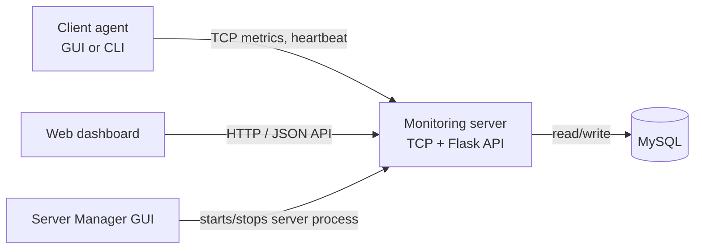

# Network Monitoring System

## 1. Overview

A Python client-server application for collecting workstation resource and network metrics. Client agents send monitoring data to a TCP server; the server persists it in MySQL and provides a Flask dashboard and JSON API.

The project includes a client GUI/CLI, a desktop server manager, a threaded TCP listener, MySQL persistence, and the web dashboard.

## 2. System Architecture

The TCP listener and Flask app are services in the same server process. The dashboard loads its data through the Flask API, which reads persisted records from MySQL.



## 3. Main Technologies

- **Python** runs the server, client, and desktop interfaces.
- **TCP sockets** carry client registration, metrics, heartbeat, and logout messages.
- **Flask / HTTP** serve the dashboard and JSON endpoints.
- **MySQL** stores clients, metric history, and alerts.
- **psutil** collects CPU, memory, disk, network, and process information.
- **threading** handles TCP client sessions and background server work.
- **mysql-connector-python** connects the server to MySQL; **python-dotenv** loads the server's project `.env` file.
- **Tkinter** provides the client and server-manager desktop GUIs.

## 4. Main Features

- Concurrent TCP client monitoring, with registration, heartbeat, and logout.
- CPU, RAM, and disk utilization collection.
- Network upload/download rates and packet counters.
- MySQL persistence for client state, metric history, and threshold alerts.
- Flask dashboard with client status, last-seen time, traffic rates, history, and alerts.
- Bounded process-list collection and an allowlist of controlled client commands.
- Desktop client GUI and CLI, plus a server-manager GUI.
- Console and rotating-file logging with configurable levels and secret redaction.

## 5. Project Structure

```text
Main.py
client/
server/
common/
tests/
docs/
requirements.txt
.env.example
```

See the [architecture](docs/ARCHITECTURE.md), [data flow](docs/DATA_FLOW.md), and [project structure](docs/PROJECT_STRUCTURE.md) documentation for details.

## 6. How the System Works

Start the server and connect one or more client agents. Each client registers and periodically sends system metrics and heartbeats over TCP. The server records data and alerts in MySQL, marks clients offline after missed heartbeats, and serves the dashboard and API over HTTP. Controlled commands and process-list requests are restricted to supported operations and require the configured admin token at their API endpoints.

## 7. Installation

Requirements: Python 3.10 or newer, a running MySQL Server, and the packages in `requirements.txt`.

From the project root in Windows PowerShell:

```powershell
python -m venv .venv
.\.venv\Scripts\Activate.ps1
python -m pip install -r requirements.txt
Copy-Item .env.example .env
```

Edit `.env` with the MySQL connection settings. The example sets `MYSQL_CREATE_DATABASE=false`, so create the configured database first and grant the account permission to create the application tables.

Start the server manager (GUI):

```powershell
python Main.py
```

Or start the server directly:

```powershell
python -m server.server
```

Start a client GUI:

```powershell
python client/monitoring_client.py
```

Start a client in CLI mode:

```powershell
python client/monitoring_client.py PC01 --cli --host 127.0.0.1 --port 8888 --interval 3
```

With the default HTTP port, open <http://localhost:8081>. The server requires MySQL; it exits rather than falling back to in-memory persistence if MySQL is unavailable.

## 8. Configuration

Server database settings are read from environment variables or the project `.env` file:

| Variable | Default | Purpose |
|---|---|---|
| `MYSQL_HOST` | `localhost` | MySQL server host |
| `MYSQL_PORT` | `3306` | MySQL server port |
| `MYSQL_USER` | `root` | MySQL account |
| `MYSQL_PASSWORD` | empty | MySQL account password |
| `MYSQL_DB` | `network_monitor` | Application database name |
| `MYSQL_CREATE_DATABASE` | `true` | Create the database if missing; set to `false` to use an existing database |
| `MONITOR_TCP_PORT` | `8888` | TCP listener port |
| `MONITOR_HTTP_PORT` | `8081` | Flask/dashboard port |
| `MONITOR_ADMIN_TOKEN` | unset | Required by process-list, controlled-command, and client-disconnect API operations |
| `LOG_LEVEL` | `INFO` | Logging threshold |
| `LOG_FILE` | `logs/server.log` | Server log file |
| `CLIENT_LOG_FILE` | `logs/client.log` | Client log file |

Keep credentials private; do not commit `.env`. The client also accepts `--host`, `--port`, `--http-port`, and `--interval` command-line options.

## 9. Documentation

- [System architecture](docs/ARCHITECTURE.md)
- [Data flow](docs/DATA_FLOW.md)
- [Project structure](docs/PROJECT_STRUCTURE.md)

## 10. Current Limitations

- TCP client traffic is not encrypted and clients are not authenticated.
- The HTTP server binds to all network interfaces by default. Configure network access appropriately; admin-token-protected API actions require `MONITOR_ADMIN_TOKEN`.
- The client supports only the server's fixed allowlist of commands; it does not execute arbitrary shell commands.
- The dashboard does not provide TLS termination; deploy it behind an appropriately configured HTTPS endpoint if access is needed beyond a trusted network.
