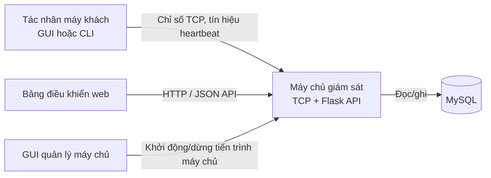

# Hệ thống giám sát mạng

## 1. Tổng quan

Ứng dụng Python theo mô hình máy khách-máy chủ, dùng để thu thập tài nguyên máy trạm và các chỉ số mạng. Các tác nhân máy khách gửi dữ liệu giám sát đến máy chủ TCP; máy chủ lưu dữ liệu trong MySQL và cung cấp bảng điều khiển Flask cùng API JSON.

Dự án gồm giao diện GUI/CLI cho máy khách, trình quản lý máy chủ trên máy tính để bàn, bộ lắng nghe TCP đa luồng, cơ chế lưu trữ MySQL và bảng điều khiển web.

## 2. Kiến trúc hệ thống

Bộ lắng nghe TCP và ứng dụng Flask là các dịch vụ chạy trong cùng một tiến trình máy chủ. Bảng điều khiển lấy dữ liệu thông qua API Flask, API này đọc các bản ghi đã lưu trong MySQL.



## 3. Công nghệ chính

- **Python** chạy máy chủ, máy khách và các giao diện máy tính để bàn.
- **TCP sockets** truyền thông điệp đăng ký máy khách, chỉ số, heartbeat và đăng xuất.
- **Flask / HTTP** cung cấp bảng điều khiển và các điểm cuối JSON.
- **MySQL** lưu thông tin máy khách, lịch sử chỉ số và cảnh báo.
- **psutil** thu thập thông tin CPU, bộ nhớ, ổ đĩa, mạng và tiến trình.
- **threading** xử lý các phiên TCP của máy khách và công việc nền của máy chủ.
- **mysql-connector-python** kết nối máy chủ với MySQL; **python-dotenv** nạp tệp `.env` của dự án trên máy chủ.
- **Tkinter** cung cấp GUI trên máy tính để bàn cho máy khách và trình quản lý máy chủ.

## 4. Tính năng chính

- Giám sát đồng thời các máy khách TCP, bao gồm đăng ký, heartbeat và đăng xuất.
- Thu thập mức sử dụng CPU, RAM và ổ đĩa.
- Theo dõi tốc độ tải lên/tải xuống mạng và bộ đếm gói tin.
- Lưu trạng thái máy khách, lịch sử chỉ số và cảnh báo ngưỡng vào MySQL.
- Bảng điều khiển Flask hiển thị trạng thái máy khách, thời điểm hoạt động gần nhất, tốc độ mạng, lịch sử và cảnh báo.
- Cửa sổ tiến trình trong GUI Tkinter hiển thị tối đa 50 tiến trình; bảng điều khiển web nhận snapshot đầy đủ có giới hạn tối đa 1.000 tiến trình. Cả hai tự làm mới mỗi 10 giây và hiển thị thời điểm cập nhật thành công gần nhất.
- Bảng điều khiển so sánh các snapshot thành công cho từng client, đánh dấu tiến trình mới/đang chạy, hiển thị lịch sử STARTED/STOPPED gần đây và giữ nguyên dữ liệu gần nhất khi collection thất bại. MySQL chỉ lưu sự kiện và giữ tối đa 500 sự kiện gần nhất cho mỗi client.
- Người quản trị có thể tìm kiếm, lọc, sắp xếp và yêu cầu kết thúc tiến trình từ GUI Tkinter hoặc bảng điều khiển web; việc kết thúc từ xa được ghi nhận là STOPPED sau snapshot hợp lệ tiếp theo.
- Lệnh quản lý tiến trình dùng HMAC-SHA256 với `MONITOR_ADMIN_TOKEN`, chỉ chấp nhận PID hợp lệ và từ chối tiến trình hệ thống/tiến trình agent được bảo vệ; các yêu cầu kết thúc được ghi vào nhật ký và bảng audit MySQL.
- Có GUI và CLI cho máy khách, cùng GUI quản lý máy chủ.
- Ghi nhật ký ra console và tệp luân phiên, hỗ trợ cấu hình mức nhật ký và che giấu bí mật.

## 5. Cấu trúc dự án

```text
Main.py
client/
server/
common/
tests/
docs/
requirements.txt
.env.example
```

Xem tài liệu [kiến trúc](docs/ARCHITECTURE.md), [luồng dữ liệu](docs/DATA_FLOW.md) và [cấu trúc dự án](docs/PROJECT_STRUCTURE.md) để biết thêm chi tiết.

## 6. Cách hệ thống hoạt động

Khởi động máy chủ rồi kết nối một hoặc nhiều tác nhân máy khách. Mỗi máy khách đăng ký và định kỳ gửi chỉ số hệ thống cùng heartbeat qua TCP. Máy chủ ghi dữ liệu và cảnh báo vào MySQL, đánh dấu máy khách ngoại tuyến nếu bỏ lỡ heartbeat, đồng thời cung cấp bảng điều khiển và API qua HTTP. Các lệnh điều khiển và yêu cầu danh sách tiến trình chỉ được giới hạn trong những thao tác được hỗ trợ và cần mã thông báo quản trị đã cấu hình tại các điểm cuối API tương ứng.

## 7. Cài đặt

Yêu cầu: Python 3.10 trở lên, MySQL Server đang chạy và các gói trong `requirements.txt`.

Mở PowerShell tại thư mục gốc dự án trên Windows:

```powershell
python -m venv .venv
.\.venv\Scripts\Activate.ps1
python -m pip install -r requirements.txt
Copy-Item .env.example .env
```

Thiết lập token quản trị để bật các thao tác quản lý tiến trình và ngắt kết nối:

```powershell
python -c "import secrets; print(secrets.token_urlsafe(32))"
```

Sao chép giá trị sinh ra và đặt vào `.env`:

```env
MONITOR_ADMIN_TOKEN=<giá-trị-vừa-sinh>
```

Cấu hình cùng giá trị trên mỗi máy khách được quản lý (qua biến môi trường hệ điều hành). Sau khi khởi động máy chủ, xác nhận trạng thái Admin Token hiển thị CONFIGURED trong GUI hoặc badge "Admin: enabled" trên bảng điều khiển web. Máy chủ đọc `.env` khi khởi động; nếu vừa sửa cấu hình trong lúc máy chủ đang chạy, hãy dừng rồi khởi động lại máy chủ để áp dụng.

Chỉnh sửa `.env` để khai báo thông tin kết nối MySQL. Tệp mẫu đặt `MYSQL_CREATE_DATABASE=false`, vì vậy hãy tạo cơ sở dữ liệu đã cấu hình trước và cấp quyền tạo các bảng ứng dụng cho tài khoản.

Để dùng API quản trị và quản lý tiến trình từ xa, tạo một khóa ngẫu nhiên dài, đặt `MONITOR_ADMIN_TOKEN` trong `.env` của máy chủ và cấu hình cùng giá trị trong biến môi trường của từng máy khách cần được quản lý. Máy khách đọc token từ môi trường hệ điều hành; không gửi hoặc commit token thật. GUI yêu cầu token quản trị khi thao tác, còn dashboard web chỉ giữ token trong bộ nhớ của trang hiện tại. Chữ ký HMAC xác thực lệnh nhưng không mã hóa kết nối TCP; chỉ sử dụng trên mạng tin cậy hoặc bổ sung lớp bảo vệ truyền tải phù hợp.

Khởi động trình quản lý máy chủ (GUI):

```powershell
python Main.py
```

Hoặc khởi động máy chủ trực tiếp:

```powershell
python -m server.server
```

Khởi động GUI máy khách:

```powershell
python client/monitoring_client.py
```

Khởi động máy khách ở chế độ CLI:

```powershell
python client/monitoring_client.py PC01 --cli --host 127.0.0.1 --port 8888 --interval 3
```

Nếu dùng cổng HTTP mặc định, mở <http://localhost:8081>. Máy chủ yêu cầu MySQL; nếu MySQL không khả dụng, tiến trình sẽ thoát thay vì chuyển sang lưu trữ trong bộ nhớ.

Để xem tiến trình, chọn máy khách đang trực tuyến trong GUI/bảng điều khiển rồi mở phần tiến trình. Danh sách được tải ngay và tự làm mới mỗi 10 giây. Lệnh danh sách cũ của GUI giới hạn ở 50 tiến trình; snapshot có giới hạn dùng cho bảng điều khiển web nhận tối đa 1.000 tiến trình để so sánh hoạt động. Bảng điều khiển hiển thị sự kiện NEW/STOPPED và trạng thái Process Monitoring; khi collection thất bại hoặc snapshot vượt giới hạn, dữ liệu hiện tại được giữ nguyên và thời điểm cập nhật thành công cuối cùng vẫn hiển thị.

## 8. Cấu hình

Các thiết lập cơ sở dữ liệu của máy chủ được đọc từ biến môi trường hoặc tệp `.env` của dự án:

| Biến | Mặc định | Mục đích |
|---|---|---|
| `MYSQL_HOST` | `localhost` | Máy chủ MySQL |
| `MYSQL_PORT` | `3306` | Cổng MySQL |
| `MYSQL_USER` | `root` | Tài khoản MySQL |
| `MYSQL_PASSWORD` | trống | Mật khẩu tài khoản MySQL |
| `MYSQL_DB` | `network_monitor` | Tên cơ sở dữ liệu ứng dụng |
| `MYSQL_CREATE_DATABASE` | `true` | Tạo cơ sở dữ liệu nếu chưa có; đặt thành `false` để dùng cơ sở dữ liệu hiện có |
| `MONITOR_TCP_PORT` | `8888` | Cổng bộ lắng nghe TCP |
| `MONITOR_HTTP_PORT` | `8081` | Cổng Flask/bảng điều khiển |
| `MONITOR_ADMIN_TOKEN` | chưa đặt | Bắt buộc cho API danh sách tiến trình, lệnh điều khiển và ngắt kết nối máy khách |
| `LOG_LEVEL` | `INFO` | Ngưỡng ghi nhật ký |
| `LOG_FILE` | `logs/server.log` | Tệp nhật ký máy chủ |
| `CLIENT_LOG_FILE` | `logs/client.log` | Tệp nhật ký máy khách |

Không chia sẻ thông tin xác thực; không commit `.env`. Cấu hình cùng `MONITOR_ADMIN_TOKEN` trên máy chủ và máy khách để bật các lệnh quản lý tiến trình được ký HMAC. Máy khách đọc biến này từ môi trường tiến trình, không tự nạp tệp `.env` ở thư mục dự án. Máy khách cũng hỗ trợ các tùy chọn dòng lệnh `--host`, `--port`, `--http-port` và `--interval`.

## 9. Tài liệu

- [Kiến trúc hệ thống](docs/ARCHITECTURE.md)
- [Luồng dữ liệu](docs/DATA_FLOW.md)
- [Cấu trúc dự án](docs/PROJECT_STRUCTURE.md)

## 10. Giới hạn hiện tại

- Lưu lượng TCP của máy khách không được mã hóa và máy khách chưa được xác thực. HMAC của lệnh quản trị chỉ bảo vệ tính toàn vẹn/xác thực lệnh, không che nội dung truyền.
- Máy chủ HTTP mặc định lắng nghe trên tất cả giao diện mạng. Hãy cấu hình quyền truy cập mạng phù hợp; các thao tác API được bảo vệ bằng mã thông báo quản trị cần `MONITOR_ADMIN_TOKEN`.
- Máy khách chỉ hỗ trợ danh sách lệnh cố định do máy chủ cho phép; không thực thi lệnh shell tùy ý.
- Bảng điều khiển không tự thiết lập TLS; nếu cần truy cập ngoài mạng tin cậy, hãy triển khai phía sau một điểm cuối HTTPS được cấu hình phù hợp.
