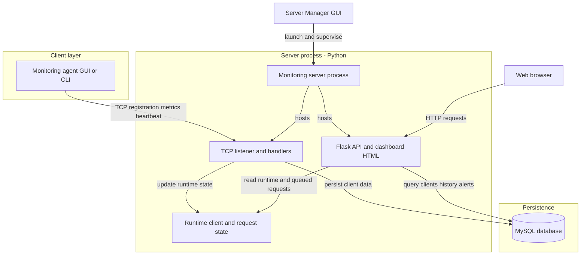
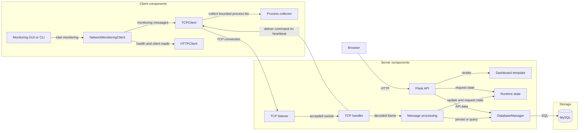

# Network Monitoring System Architecture

This document describes the implementation in the repository, centered on
`server/server.py`, `client/`, and `common/database.py`. The main server process
hosts both the TCP listener and Flask application; MySQL is its persistent
store.

## 1. System Architecture

### Major components

- **Client** (`client/monitoring_client.py`): the workstation-side GUI or CLI.
  It collects metrics through `psutil`, registers with the server, sends
  measurements and heartbeats, and logs out on graceful shutdown.
- **TCP server** (`server/server.py`): accepts client connections, parses
  newline-delimited messages, updates client data, and sends acknowledgements.
  Each accepted connection is handled by a daemon thread.
- **MySQL database** (`common/database.py`): stores durable client records,
  current measurements and status, measurement history, and threshold alerts.
  The server requires this database at startup; it does not substitute
  in-memory storage for persistence.
- **Flask HTTP API** (`server/server.py`): serves the dashboard HTML and JSON
  endpoints. The same server process runs it alongside the TCP listener.
- **Dashboard**: HTML, CSS, and JavaScript embedded in `server/server.py`.
  The browser requests client and alert data from the Flask API and refreshes
  periodically.
- **Server Manager GUI** (`Main.py`, `server/server_gui.py`): starts the
  server as a subprocess, lets the operator choose TCP/HTTP ports, displays
  server output, and opens the dashboard.

<!-- mermaid-checked: no \n, no em-dash/en-dash, no {} in labels, subgraphs are id["label"], arrows are -->|"label"|, all subgraphs closed by end, ids unique -->

The arrows represent observed application calls and network traffic. The
browser uses HTTP to reach Flask; Flask and the TCP listener are not separate
networked services from one another, but parts of the same Python process.
Both access the same `DatabaseManager` instance.

### Component relationships

This view separates the GUI/CLI entry points, client helpers, server
responsibilities, and persistence component. `HTTPClient` is used by the
client for health and client-list requests; monitoring telemetry itself uses
the TCP client.

<!-- mermaid-checked: no \n, no em-dash/en-dash, no {} in labels, subgraphs are id["label"], arrows are -->|"label"|, all subgraphs closed by end, ids unique -->

| Component | Layer | Type | Responsibility |
|---|---|---|---|
| `ClientGUI` / CLI runner | Client | UI / entry point | Starts and stops the agent; displays status and metrics. |
| `NetworkMonitoringClient` | Client | Coordinator | Coordinates metric collection, registration, heartbeat, and logout. |
| `TCPClient` | Client | Transport/protocol | Builds monitoring frames, sends them, reads responses, and answers supported commands. |
| `HTTPClient` | Client | HTTP helper | Reads health and client-list API endpoints. |
| `collect_process_list` | Client | Metric collector | Collects at most 20 process records using `psutil`. |
| TCP listener and handler | Server | Transport | Accepts TCP sockets and processes framed messages in handler threads. |
| `handle_message` | Server | Message dispatcher | Validates and routes monitoring and response messages. |
| Flask app and dashboard template | Server | HTTP/API and UI | Serves the dashboard and JSON endpoints. |
| `DatabaseManager` | Persistence access | Data access | Performs synchronized MySQL operations and recovery checks. |
| MySQL | Persistence | Database | Holds client, history, and alert records. |

### Technology summary

| Layer | Technology | Version information in repository | Purpose |
|---|---|---|---|
| Application | Python | No minimum/runtime pin declared | Runs server, agents, and desktop GUIs |
| Client-server transport | TCP sockets | Python standard library | Carries client messages and command replies |
| Web | Flask | `Flask>=2.0.0` | Serves dashboard and HTTP API |
| Persistence | MySQL Connector/Python | `mysql-connector-python>=8.0.0` | Executes database operations |
| Metrics | psutil | `psutil>=5.8.0` | Reads resource, network, and process data |
| Desktop UI | Tkinter | Python standard library | Client and server-manager GUIs |
| Configuration | python-dotenv | `python-dotenv>=1.0.0` | Loads project `.env` settings for database initialization |
| Concurrency | threading | Python standard library | TCP handlers, Flask requests, and background tasks |

### Storage and external services

MySQL is the only persistent application datastore used by the server. No
cache, message broker, or external monitoring API is configured in the
inspected source. The client uses the local operating system through `psutil`
and sends collected values to the server.

### Key architectural decisions visible in code

- The TCP server, Flask API, and embedded dashboard are hosted in one server
  process.
- TCP client sessions are handled with a thread-per-accepted-connection
  pattern; Flask is started with threaded request handling.
- `DatabaseManager` synchronizes its database operations, while server
  runtime state uses a separate reentrant lock.

## 2. Client Architecture

### Entry points and components

- `client/monitoring_client.py` defines `main()`. With no mode flags it starts
  the desktop GUI when Tkinter is available. `--gui` selects the GUI;
  `--cli`, or a supplied client name without `--gui`, selects CLI mode.
- `NetworkMonitoringClient` in the same module coordinates client operations:
  registration, metric collection, heartbeat, logout, and optional HTTP
  health/client-list calls.
- `ClientGUI` displays collected metrics and runs its monitoring loop in a
  worker thread. The CLI uses `run_cli()` and prints operator-facing status
  and measurements.
- `client/tcp_client.py` implements TCP connection, message construction,
  response framing, and allowlisted command replies.
- `client/http_client.py` is a small HTTP helper for health and client-list
  requests. The monitoring loop's registration, metrics, heartbeat, and
  logout traffic uses TCP, not this HTTP helper.
- `client/process_monitor.py` collects a bounded process list through
  `psutil`. `client/protocol.py` re-exports helpers from `shared/protocol.py`,
  but the inspected `TCPClient` performs its own message formatting and
  parsing; those re-exported helpers are not used by that TCP path.

The client initiates outgoing connections to the server; it does not create a
listening socket or accept incoming TCP connections. Each normal operation
uses `socket.create_connection()` in `TCPClient.send()`. When a heartbeat
response contains a queued command, the client handles the command and sends
its response on that same socket before the exchange closes.

## 3. Server Architecture

### TCP listener and client handlers

`tcp_server()` creates an IPv4 stream socket, enables address reuse, binds to
`0.0.0.0` and the configured TCP port, listens with a backlog of 50, then
accepts connections in a loop. For each accepted socket it starts a daemon
thread running `tcp_client_session()`. The handler receives data, assembles
newline-terminated messages, dispatches them to `handle_message()`, writes a
newline-terminated response, and closes the connection in `finally`.

### Processing and state

`handle_message()` dispatches registration, system metrics, heartbeat,
logout, process-list replies, and controlled-command replies. Registration
uses the name as the logical identity: the in-memory maps and MySQL
`client_key` use `name.lower()`. The server records the peer IP from the
accepted socket address rather than trusting the address text supplied in a
registration message.

The module-level runtime structures hold current in-process client
information, disconnected-client keys, pending process requests, and pending
controlled commands. They support online status, recent heartbeat timing,
capability tracking, and asynchronous request/result exchanges. They are not a
replacement for the corresponding persistent client/history/alert records.

Metrics are parsed and validated before persistence. CPU, RAM, disk, and the
legacy network metric must be percentages from 0 through 100. Upload/download
rates and packet counters are parsed separately. CPU over 80%, RAM over 80%,
and disk over 90% generate alert records.

The background `mark_offline_clients()` task checks runtime heartbeat times
every two seconds and marks clients offline after 15 seconds without
activity. At startup, the server connects to MySQL and marks stored clients
offline before starting the background checker, TCP listener, and Flask app.
If required database initialization fails, startup stops.

### Flask and dashboard

The Flask app and the dashboard template are defined in `server/server.py`.
The root route renders the embedded dashboard; API routes query
`DatabaseManager` for persisted data and use runtime state where relevant.
Dashboard JavaScript fetches `/api/clients` and `/api/alerts` every 2.5
seconds; history is requested when needed for a client chart.

The server binds HTTP to `0.0.0.0`. The TCP port defaults to `8888` and HTTP
defaults to `8081`; `MONITOR_TCP_PORT` and `MONITOR_HTTP_PORT` can override
them.

## 4. TCP Communication

### Socket lifecycle and framing

| Operation | Implementation |
|---|---|
| Server socket creation | `socket.socket(socket.AF_INET, socket.SOCK_STREAM)` in `tcp_server()` |
| Server bind/listen/accept | `bind((TCP_HOST, TCP_PORT))`, `listen(50)`, and `accept()` in `tcp_server()` |
| Client connection | `socket.create_connection((host, port), timeout=5)` in `TCPClient.send()` |
| Receive | Server handler calls `recv(4096)`; client `_read_line()` calls `recv(4096)` |
| Send | Client and server use `sendall()` |
| Message framing | Each message is terminated by `\n`; the server buffers and splits complete lines |
| Encoding | UTF-8; server decodes received client bytes with replacement for invalid sequences |
| Close | Client uses a socket context manager; server handler closes the accepted socket in `finally` |

The TCP server host is `0.0.0.0`; port defaults to `8888` and is configurable
through `MONITOR_TCP_PORT`. Accepted server connections have a 30-second
socket timeout. The normal client operation opens a connection, sends one
request and reads its response, then closes it. A heartbeat exchange may
carry an additional controlled-command request and response on that same
connection.

### Monitoring messages

Messages are pipe-delimited. The current `TCPClient` sends the following
formats (metric keys are case-insensitive at the server):

| Message | Structure and purpose |
|---|---|
| `REGISTER` | `REGISTER|<client_name>|<server_host>|<tcp_port>|PROCESS_LIST_V1|CONTROLLED_COMMANDS_V1` from the current client. The server requires a name and records the peer IP from the socket. Capability fields are optional for older clients. |
| `SYSTEM` | `SYSTEM|<client_name>|CPU=<percent>|RAM=<percent>|DISK=<percent>|NETWORK=<percent>|UPLOAD_BPS=<rate-or-null>|DOWNLOAD_BPS=<rate-or-null>|PACKETS_SENT=<count-or-null>|PACKETS_RECV=<count-or-null>`. Optional metric fields may be omitted. |
| `HEARTBEAT` | `HEARTBEAT|<client_name>`. Updates persisted last-seen and may receive a queued command. |
| `LOGOUT` | `LOGOUT|<client_name>`. Marks the registered client offline. |

Normal acknowledgements include `OK|REGISTERED`, `OK|SYSTEM`,
`OK|HEARTBEAT`, and `OK|LOGOUT`. Failures use `ERROR|...` responses.

### Process monitoring and controlled command messages

These features are implemented as bounded, allowlisted operations, not as
arbitrary command execution. The server queues requests and delivers them on
a compatible client's subsequent heartbeat. The current command frame is
`COMMAND|<request_id>|<command>`; process-list commands include a limit as an
additional field. Supported commands are `PING`, `GET_INFO`,
`GET_PROCESS_LIST`, and `GET_NETWORK_INFO`.

The client replies using `RESPONSE|<request_id>|<payload>` or
`COMMAND_ERROR|<request_id>|<error_code>`. Process-list responses use JSON and
are limited to at most 20 entries. The server validates request IDs, result
fields, sizes, and operation names, then acknowledges the response. A legacy
process-list frame is also accepted by the client/server path for
compatibility.

## 5. HTTP Communication

The Flask application uses host `0.0.0.0`, default port `8081`, and
`MONITOR_HTTP_PORT` for override. It is started with `threaded=True` and
`use_reloader=False`. The dashboard HTML is served from `/`; its JavaScript
uses browser `fetch()` calls to the API.

| Method | Endpoint | Purpose |
|---|---|---|
| GET | `/` | Render the dashboard HTML. |
| GET | `/api/health` | Return service ports, storage availability, and whether admin disconnect is enabled. |
| GET | `/api/clients` | Return stored client records, current metrics/status, and runtime heartbeat age when available. |
| GET | `/api/clients/<name>/history` | Return up to 120 stored metric samples for a client. |
| GET | `/api/alerts` | Return up to 100 most recent stored alerts. |
| POST | `/api/clients/<name>/process-list` | Queue a process-list request for a compatible online client. |
| GET | `/api/clients/<name>/process-list` | Read the tracked process-list request/result state. |
| POST | `/api/clients/<name>/commands` | Queue an allowlisted command; JSON body is `{"command":"PING"}` or another supported command. |
| GET | `/api/clients/<name>/commands` | Read the tracked controlled-command request/result state. |
| POST | `/api/clients/<name>/disconnect` | Mark the client offline through the admin API. |

The process-list, commands, and disconnect routes require the
`X-Admin-Token` header to match the configured `MONITOR_ADMIN_TOKEN`. Process
list and command requests are queued; the API returns a request/result state
while delivery and completion happen through a subsequent TCP heartbeat
exchange. The source does not define a request body for the process-list
endpoint or disconnect endpoint.

## 6. TCP vs HTTP

| Aspect | TCP | HTTP |
|---|---|---|
| Used for | Client registration, metrics, heartbeats, logout, and client command replies | Browser dashboard, JSON API reads, and queued administrative actions |
| Connection | Client opens short-lived TCP sockets per operation; heartbeat may include a command exchange | Browser sends HTTP requests to Flask routes |
| Client | Monitoring agent GUI or CLI | Web browser; HTTP helper also calls health/client-list routes |
| Server | TCP listener in `server/server.py` | Flask app in the same module/process |
| Data | UTF-8, pipe-delimited lines ending in newline; selected command results contain JSON | HTML for `/`; JSON request/response bodies for API routes |
| Default port | `8888` | `8081` |

The project uses TCP for the agent's compact monitoring protocol and for
command/reply exchanges. HTTP provides dashboard delivery and browser/API
operations. Both listeners live in the same server process and share MySQL
access.

## 7. Client-Server Relationship

- The monitoring agent acts as a TCP client only: it calls
  `socket.create_connection()` and contains no listener or `accept()` loop.
- The server accepts connections and creates a handler thread for each
  accepted socket.
- The server identifies a client logically by its registered name, normalized
  to lowercase for the database key and in-memory maps. The server records
  the IP address from the socket peer address.
- Registration is not authenticated by a client credential in the inspected
  TCP protocol. A client name identifies records; it does not prove client
  identity.
- Capability flags indicate whether a client advertises support for process
  lists and controlled commands.

## 8. MySQL Architecture

`DatabaseManager` in `common/database.py` owns the server's MySQL connection.
It reads `MYSQL_HOST`, `MYSQL_PORT`, `MYSQL_USER`, `MYSQL_PASSWORD`,
`MYSQL_DB`, and `MYSQL_CREATE_DATABASE`. `python-dotenv` loads the project
`.env` before that manager is instantiated. The manager creates/validates
tables, checks connection health with `SELECT 1`, performs bounded recovery
for transient connection failures, and does not report in-memory persistence
as a substitute for MySQL.

SQL operations use parameter placeholders for values. Database-manager
operations are wrapped with a reentrant lock to serialize access through the
shared connection. Writes commit successful operations; failed operations
attempt rollback.

| Table | Stored data |
|---|---|
| `clients` | Unique lowercase `client_key`, name, IP, latest CPU/RAM/disk/network metrics, traffic rates/counters, online status, `last_seen`, and `registered_at`. |
| `history` | Time-stamped per-client metric samples, including the traffic fields. Indexed by client key and timestamp. |
| `alerts` | Client, metric name, observed value, threshold, and timestamp. |

The `clients` row is updated with latest metrics and status; each metrics
message also inserts a `history` row. Threshold crossings insert `alerts`
rows. Heartbeat and logout/offline processing update the persisted status and
last-seen data where applicable.

Runtime maps in `server/server.py` hold active-session timing, capability
flags, disconnected markers, and pending process/command requests. They are
process-local and disappear on restart. Persistent client, metric history,
and alert records remain in MySQL. At startup the server marks all stored
clients offline; live runtime state is rebuilt as clients reconnect.

## 9. Concurrency

- The TCP accept loop creates one daemon thread per accepted client
  connection. A client operation is normally short-lived, so those handler
  threads usually finish after processing the request/response and socket
  closure.
- Flask is started with threaded request handling.
- A background daemon thread checks heartbeats and updates offline status.
- `state_lock` protects shared in-memory maps and request state. It is an
  `RLock`, allowing nested state-helper calls.
- `DatabaseManager` uses its own `RLock` to serialize operations on the shared
  MySQL connection.

The in-memory lock and database lock are separate; a runtime state change and
its corresponding SQL operation are not one cross-resource atomic
transaction. Therefore, during concurrent updates there can be a brief
interval where runtime state and the persisted row are not yet synchronized.

## 10. Security

### Implemented

- Admin-only HTTP operations compare the supplied `X-Admin-Token` to
  `MONITOR_ADMIN_TOKEN` using `hmac.compare_digest`.
- TCP message metrics, command names, process-list results, request IDs, and
  payload sizes are validated. Process enumeration is capped at 20 entries.
- Controlled client operations are allowlisted; arbitrary shell or Python
  execution is not implemented.
- Database values are passed using parameterized SQL. Database identifiers
  such as the configured database name are validated before interpolation.
- Logging configuration redacts common password/token forms, and code avoids
  intentionally logging the admin token or MySQL password.

### Not implemented

- TCP client authentication or cryptographic identity verification.
- TLS for TCP or HTTPS termination in this Flask application.
- The admin token is a shared secret for selected API endpoints, not a login
  system for all dashboard/API access. The dashboard and read-only API routes
  are not protected by that token in the inspected route code.
- The Flask application uses `app.run()`; no production WSGI server is
  configured by the project.

## 11. Architecture Limitations

- Runtime client state and queued request state are held in process memory;
  pending requests and capability information are not durable across a
  server restart.
- Each accepted TCP connection has a 30-second timeout. The built-in client
  normally opens short-lived connections rather than maintaining a
  continuously open socket.
- TCP traffic is unencrypted, and registration does not authenticate the
  sender. Network exposure must be controlled externally.
- Flask binds to all interfaces by default and does not configure TLS itself.
- Database access is serialized through a single `DatabaseManager`
  connection/lock, which limits parallel query execution.
- `requirements.txt` specifies package lower bounds, but the repository does
  not declare a supported Python version range.
- The module `shared/protocol.py` and `client/protocol.py` provide protocol
  encode/decode helpers, but the active `TCPClient` implementation builds and
  parses its frames directly; use of those helpers in the monitoring flow
  could not be verified.
