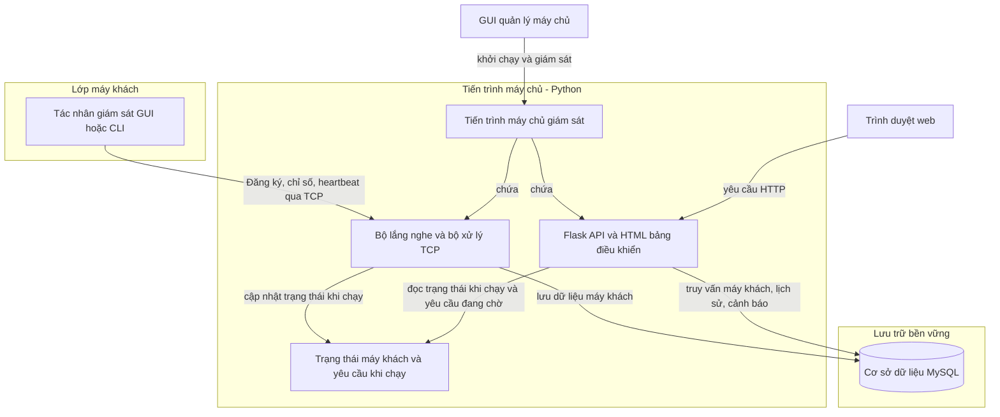
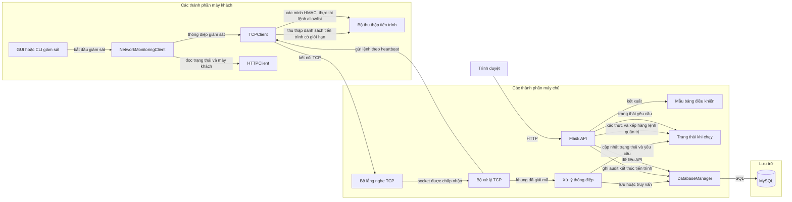

# Kiến trúc hệ thống giám sát mạng

Tài liệu này mô tả phần triển khai trong kho lưu trữ, tập trung vào
`server/server.py`, `client/` và `common/database.py`. Tiến trình máy chủ
chính chạy cả bộ lắng nghe TCP lẫn ứng dụng Flask; MySQL là nơi lưu trữ dữ
liệu bền vững.

## 1. Kiến trúc hệ thống

### Các thành phần chính

- **Máy khách** (`client/monitoring_client.py`): GUI hoặc CLI chạy trên máy
  trạm. Thành phần này thu thập chỉ số qua `psutil`, đăng ký với máy chủ, gửi
  số đo và heartbeat, rồi đăng xuất khi tắt đúng cách.
- **Máy chủ TCP** (`server/server.py`): chấp nhận kết nối máy khách, phân tích
  thông điệp phân tách theo dòng, cập nhật dữ liệu máy khách và gửi xác nhận.
  Mỗi kết nối được chấp nhận do một luồng daemon xử lý.
- **Cơ sở dữ liệu MySQL** (`common/database.py`): lưu bền vững các bản ghi máy
  khách, số đo và trạng thái hiện tại, lịch sử số đo, cảnh báo ngưỡng và audit
  kết thúc tiến trình. Máy chủ yêu cầu cơ sở dữ liệu này khi khởi động; không
  thay thế lưu trữ bền vững bằng bộ nhớ trong.
- **Flask HTTP API** (`server/server.py`): cung cấp HTML của bảng điều khiển
  và các điểm cuối JSON. Cùng tiến trình máy chủ chạy Flask bên cạnh bộ lắng
  nghe TCP.
- **Bảng điều khiển**: HTML, CSS và JavaScript được nhúng trong
  `server/server.py`. Trình duyệt yêu cầu dữ liệu máy khách và cảnh báo từ
  Flask API rồi cập nhật định kỳ; người quản trị có thể chọn máy khách để lấy
  danh sách tiến trình, lọc/sắp xếp và yêu cầu kết thúc PID qua cùng luồng lệnh
  heartbeat.
- **GUI quản lý máy chủ** (`Main.py`, `server/server_gui.py`): khởi chạy máy
  chủ dưới dạng tiến trình con, cho phép người vận hành chọn cổng TCP/HTTP,
  hiển thị đầu ra máy chủ, mở bảng điều khiển và mở cửa sổ chi tiết tiến trình
  của máy khách.
- **Xác thực lệnh quản trị** (`common/command_auth.py`): ký lệnh quản lý tiến
  trình bằng HMAC-SHA256 với `MONITOR_ADMIN_TOKEN`; máy khách xác minh chữ ký
  và chống phát lại theo mã yêu cầu. Chữ ký không mã hóa lưu lượng TCP.
- **Audit kết thúc tiến trình** (`common/database.py`): lưu yêu cầu, kết quả,
  PID, máy khách, IP và lý do thất bại trong bảng
  `process_termination_audit`; không lưu snapshot danh sách tiến trình.

<!-- mermaid-checked: no \n, no em-dash/en-dash, no {} in labels, subgraphs are id["label"], arrows are -->|"label"|, all subgraphs closed by end, ids unique -->

Các mũi tên biểu thị lời gọi ứng dụng và lưu lượng mạng đã quan sát được.
Trình duyệt dùng HTTP để truy cập Flask; Flask và bộ lắng nghe TCP không phải
hai dịch vụ mạng riêng biệt mà là các thành phần của cùng tiến trình Python.
Cả hai cùng truy cập một đối tượng `DatabaseManager`.

### Quan hệ giữa các thành phần

Sơ đồ này tách riêng các điểm vào GUI/CLI, thành phần trợ giúp máy khách,
trách nhiệm của máy chủ và thành phần lưu trữ. Máy khách dùng `HTTPClient`
cho các yêu cầu trạng thái và danh sách máy khách; bản thân dữ liệu giám sát
được truyền qua máy khách TCP.

<!-- mermaid-checked: no \n, no em-dash/en-dash, no {} in labels, subgraphs are id["label"], arrows are -->|"label"|, all subgraphs closed by end, ids unique -->

| Thành phần | Lớp | Loại | Trách nhiệm |
|---|---|---|---|
| `ClientGUI` / bộ chạy CLI | Máy khách | Giao diện / điểm vào | Khởi động và dừng tác nhân; hiển thị trạng thái và chỉ số. |
| `NetworkMonitoringClient` | Máy khách | Bộ điều phối | Điều phối việc thu thập chỉ số, đăng ký, heartbeat và đăng xuất. |
| `TCPClient` | Máy khách | Truyền tải/giao thức | Tạo khung giám sát, gửi khung, xác minh chữ ký và trả lời lệnh được hỗ trợ. |
| `HTTPClient` | Máy khách | Trợ giúp HTTP | Đọc các điểm cuối API trạng thái và danh sách máy khách. |
| `collect_process_list` | Máy khách | Bộ thu thập chỉ số | Thu thập tối đa 20 bản ghi tiến trình bằng `psutil`. |
| Bộ lắng nghe và bộ xử lý TCP | Máy chủ | Truyền tải | Chấp nhận socket TCP và xử lý thông điệp đã đóng khung trong các luồng xử lý. |
| `handle_message` | Máy chủ | Bộ điều phối thông điệp | Kiểm tra và định tuyến thông điệp giám sát và phản hồi. |
| Flask app và mẫu bảng điều khiển | Máy chủ | HTTP/API và giao diện | Cung cấp bảng điều khiển và các điểm cuối JSON. |
| `DatabaseManager` | Truy cập lưu trữ | Truy cập dữ liệu | Thực hiện thao tác MySQL có đồng bộ, kiểm tra khả năng khôi phục và ghi audit kết thúc tiến trình. |
| MySQL | Lưu trữ | Cơ sở dữ liệu | Lưu các bản ghi máy khách, lịch sử và cảnh báo. |

### Tóm tắt công nghệ

| Lớp | Công nghệ | Thông tin phiên bản trong kho lưu trữ | Mục đích |
|---|---|---|---|
| Ứng dụng | Python | Không khai báo phiên bản tối thiểu/runtime cố định | Chạy máy chủ, tác nhân và GUI máy tính để bàn |
| Truyền tải máy khách-máy chủ | TCP sockets | Thư viện chuẩn Python | Truyền thông điệp máy khách và phản hồi lệnh |
| Web | Flask | `Flask>=2.0.0` | Cung cấp bảng điều khiển và HTTP API |
| Lưu trữ bền vững | MySQL Connector/Python | `mysql-connector-python>=8.0.0` | Thực hiện thao tác cơ sở dữ liệu |
| Chỉ số | psutil | `psutil>=5.8.0` | Đọc dữ liệu tài nguyên, mạng và tiến trình |
| Giao diện máy tính để bàn | Tkinter | Thư viện chuẩn Python | GUI máy khách và trình quản lý máy chủ |
| Cấu hình | python-dotenv | `python-dotenv>=1.0.0` | Nạp thiết lập `.env` của dự án khi khởi tạo cơ sở dữ liệu |
| Đồng thời | threading | Thư viện chuẩn Python | Bộ xử lý TCP, yêu cầu Flask và tác vụ nền |

### Lưu trữ và dịch vụ bên ngoài

MySQL là kho dữ liệu ứng dụng bền vững duy nhất mà máy chủ sử dụng. Trong mã
nguồn đã kiểm tra không cấu hình bộ nhớ đệm, message broker hay API giám sát
bên ngoài. Máy khách dùng hệ điều hành cục bộ thông qua `psutil`, sau đó gửi
các giá trị thu thập được đến máy chủ.

### Các quyết định kiến trúc thể hiện trong mã nguồn

- Máy chủ TCP, Flask API và bảng điều khiển nhúng được chạy trong cùng một
  tiến trình máy chủ.
- Các phiên TCP của máy khách được xử lý theo mô hình một luồng cho mỗi kết
  nối được chấp nhận; Flask khởi chạy với chế độ xử lý yêu cầu đa luồng.
- `DatabaseManager` đồng bộ hóa các thao tác cơ sở dữ liệu; trạng thái thời
  gian chạy của máy chủ dùng một khóa reentrant riêng.

## 2. Kiến trúc máy khách

### Điểm vào và thành phần

- `client/monitoring_client.py` định nghĩa `main()`. Nếu không có cờ chế độ,
  chương trình khởi động GUI máy tính để bàn khi Tkinter khả dụng. `--gui`
  chọn GUI; `--cli` hoặc cung cấp tên máy khách mà không có `--gui` sẽ chọn
  chế độ CLI.
- `NetworkMonitoringClient` trong cùng mô-đun điều phối các thao tác máy
  khách: đăng ký, thu thập chỉ số, heartbeat, đăng xuất và tùy chọn gọi HTTP
  để lấy trạng thái/danh sách máy khách.
- `ClientGUI` hiển thị chỉ số đã thu thập và chạy vòng lặp giám sát trong
  luồng worker. CLI dùng `run_cli()` và in trạng thái, số đo dành cho người
  vận hành.
- `client/tcp_client.py` triển khai kết nối TCP, tạo thông điệp, đóng khung
  phản hồi và trả lời các lệnh nằm trong danh sách cho phép.
- `client/http_client.py` là bộ trợ giúp HTTP nhỏ cho yêu cầu trạng thái và
  danh sách máy khách. Lưu lượng đăng ký, chỉ số, heartbeat và đăng xuất của
  vòng lặp giám sát dùng TCP, không dùng bộ trợ giúp HTTP này.
- `client/process_monitor.py` thu thập danh sách tiến trình có giới hạn thông
  qua `psutil`. `client/protocol.py` tái xuất các hàm trợ giúp từ
  `shared/protocol.py`, nhưng `TCPClient` đã kiểm tra tự định dạng và phân
  tích thông điệp; chưa thấy các hàm được tái xuất này được dùng trong luồng
  TCP đó.

Máy khách chủ động tạo kết nối đi ra đến máy chủ; nó không tạo socket lắng
nghe hoặc vòng lặp chấp nhận kết nối TCP đến. Mỗi thao tác thông thường dùng
`socket.create_connection()` trong `TCPClient.send()`. Khi phản hồi heartbeat
có lệnh đang chờ, máy khách xử lý lệnh rồi gửi phản hồi trên cùng socket trước
khi kết thúc trao đổi.

## 3. Kiến trúc máy chủ

### Bộ lắng nghe TCP và bộ xử lý máy khách

`tcp_server()` tạo socket luồng IPv4, bật tùy chọn dùng lại địa chỉ, gắn vào
`0.0.0.0` cùng cổng TCP đã cấu hình, đặt hàng đợi chờ ở mức 50 rồi chấp nhận
kết nối trong một vòng lặp. Với mỗi socket được chấp nhận, hàm khởi chạy một
luồng daemon chạy `tcp_client_session()`. Bộ xử lý nhận dữ liệu, ghép thành
các thông điệp kết thúc bằng newline, chuyển chúng đến `handle_message()`,
ghi phản hồi kết thúc bằng newline rồi đóng kết nối trong `finally`.

### Xử lý và trạng thái

`handle_message()` điều phối đăng ký, chỉ số hệ thống, heartbeat, đăng xuất,
phản hồi danh sách tiến trình và phản hồi lệnh điều khiển. Đăng ký dùng tên
làm định danh logic: các map trong bộ nhớ và `client_key` MySQL dùng
`name.lower()`. Máy chủ ghi IP peer lấy từ địa chỉ socket được chấp nhận thay
vì tin địa chỉ văn bản trong thông điệp đăng ký.

Các cấu trúc thời gian chạy cấp mô-đun chứa thông tin máy khách hiện tại
trong tiến trình, khóa máy khách đã ngắt kết nối, yêu cầu tiến trình đang chờ
và lệnh điều khiển đang chờ. Chúng hỗ trợ trạng thái trực tuyến, thời gian
heartbeat gần nhất, theo dõi khả năng và trao đổi yêu cầu/kết quả bất đồng
bộ. Chúng không thay thế các bản ghi máy khách/lịch sử/cảnh báo tương ứng
được lưu bền vững.

Chỉ số được phân tích và kiểm tra trước khi lưu. CPU, RAM, ổ đĩa và chỉ số
mạng kiểu cũ phải nằm trong khoảng phần trăm từ 0 đến 100. Tốc độ tải lên/tải
xuống và bộ đếm gói được phân tích riêng. CPU trên 80%, RAM trên 80% và ổ đĩa
trên 90% sẽ tạo bản ghi cảnh báo.

Tác vụ nền `mark_offline_clients()` kiểm tra thời điểm heartbeat trong bộ
nhớ mỗi hai giây và đánh dấu máy khách ngoại tuyến sau 15 giây không hoạt
động. Khi khởi động, máy chủ kết nối MySQL và đánh dấu các máy khách đã lưu
là ngoại tuyến trước khi khởi chạy bộ kiểm tra nền, bộ lắng nghe TCP và Flask
app. Nếu khởi tạo cơ sở dữ liệu bắt buộc thất bại, quá trình khởi động dừng
lại.

### Flask và bảng điều khiển

Flask app và mẫu bảng điều khiển được định nghĩa trong `server/server.py`.
Route gốc kết xuất bảng điều khiển nhúng; các route API truy vấn
`DatabaseManager` để lấy dữ liệu đã lưu và dùng trạng thái thời gian chạy khi
cần. JavaScript của bảng điều khiển tải `/api/clients` và `/api/alerts` mỗi
2,5 giây; lịch sử được yêu cầu khi cần vẽ biểu đồ cho máy khách.

Máy chủ gắn HTTP vào `0.0.0.0`. Cổng TCP mặc định là `8888`, cổng HTTP mặc
định là `8081`; có thể ghi đè bằng `MONITOR_TCP_PORT` và
`MONITOR_HTTP_PORT`.

## 4. Giao tiếp TCP

### Vòng đời socket và đóng khung thông điệp

| Thao tác | Cách triển khai |
|---|---|
| Tạo socket máy chủ | `socket.socket(socket.AF_INET, socket.SOCK_STREAM)` trong `tcp_server()` |
| Gắn địa chỉ/lắng nghe/chấp nhận phía máy chủ | `bind((TCP_HOST, TCP_PORT))`, `listen(50)` và `accept()` trong `tcp_server()` |
| Kết nối máy khách | `socket.create_connection((host, port), timeout=5)` trong `TCPClient.send()` |
| Nhận | Bộ xử lý máy chủ gọi `recv(4096)`; phía máy khách gọi `recv(4096)` trong `_read_line()` |
| Gửi | Máy khách và máy chủ dùng `sendall()` |
| Đóng khung thông điệp | Mỗi thông điệp kết thúc bằng `\n`; máy chủ đệm dữ liệu và tách các dòng hoàn chỉnh |
| Mã hóa | UTF-8; máy chủ giải mã byte nhận được từ máy khách, thay thế chuỗi không hợp lệ |
| Đóng | Máy khách dùng socket context manager; bộ xử lý máy chủ đóng socket được chấp nhận trong `finally` |

Máy chủ TCP dùng host `0.0.0.0`; cổng mặc định `8888` và có thể cấu hình qua
`MONITOR_TCP_PORT`. Kết nối máy chủ được chấp nhận có timeout socket 30 giây.
Thao tác máy khách thông thường mở kết nối, gửi một yêu cầu, đọc phản hồi rồi
đóng kết nối. Trao đổi heartbeat có thể mang thêm yêu cầu và phản hồi lệnh
điều khiển trên cùng kết nối đó.

### Thông điệp giám sát

Thông điệp được phân tách bằng dấu pipe. `TCPClient` hiện tại gửi các định
dạng sau (khóa chỉ số không phân biệt chữ hoa/chữ thường ở phía máy chủ):

| Thông điệp | Cấu trúc và mục đích |
|---|---|
| `REGISTER` | `REGISTER|<client_name>|<server_host>|<tcp_port>|PROCESS_LIST_V1|CONTROLLED_COMMANDS_V1` từ máy khách hiện tại. Máy chủ yêu cầu tên và ghi IP peer lấy từ socket. Các trường khả năng là tùy chọn đối với máy khách cũ. |
| `SYSTEM` | `SYSTEM|<client_name>|CPU=<percent>|RAM=<percent>|DISK=<percent>|NETWORK=<percent>|UPLOAD_BPS=<rate-or-null>|DOWNLOAD_BPS=<rate-or-null>|PACKETS_SENT=<count-or-null>|PACKETS_RECV=<count-or-null>`. Có thể bỏ các trường chỉ số tùy chọn. |
| `HEARTBEAT` | `HEARTBEAT|<client_name>`. Cập nhật thời điểm hoạt động gần nhất đã lưu và có thể nhận một lệnh đang chờ. |
| `LOGOUT` | `LOGOUT|<client_name>`. Đánh dấu máy khách đã đăng ký là ngoại tuyến. |

Các xác nhận thông thường gồm `OK|REGISTERED`, `OK|SYSTEM`,
`OK|HEARTBEAT` và `OK|LOGOUT`. Lỗi dùng phản hồi `ERROR|...`.

### Theo dõi tiến trình và thông điệp lệnh điều khiển

Các tính năng này được triển khai dưới dạng thao tác có giới hạn và nằm
trong danh sách cho phép, không phải thực thi lệnh tùy ý. Máy chủ xếp hàng
yêu cầu và gửi chúng trong heartbeat tiếp theo của máy khách tương thích.
Khung lệnh hiện tại là `COMMAND|<request_id>|<command>`; lệnh danh sách tiến
trình có thêm trường giới hạn. Các lệnh được hỗ trợ gồm `PING`, `GET_INFO`,
`GET_PROCESS_LIST` và `GET_NETWORK_INFO`.

Máy khách phản hồi bằng `RESPONSE|<request_id>|<payload>` hoặc
`COMMAND_ERROR|<request_id>|<error_code>`. Phản hồi danh sách tiến trình dùng
JSON và tối đa 20 mục. Máy chủ kiểm tra ID yêu cầu, trường kết quả, kích
thước và tên thao tác, sau đó xác nhận phản hồi. Đường xử lý máy khách/máy
chủ cũng chấp nhận khung danh sách tiến trình kiểu cũ để tương thích.

## 5. Giao tiếp HTTP

Ứng dụng Flask dùng host `0.0.0.0`, cổng mặc định `8081` và biến
`MONITOR_HTTP_PORT` để ghi đè. Ứng dụng được khởi chạy với `threaded=True`
và `use_reloader=False`. HTML của bảng điều khiển được cung cấp tại `/`;
JavaScript dùng `fetch()` của trình duyệt để gọi API.

| Phương thức | Điểm cuối | Mục đích |
|---|---|---|
| GET | `/` | Kết xuất HTML của bảng điều khiển. |
| GET | `/api/health` | Trả về cổng dịch vụ, tình trạng lưu trữ và trạng thái bật/tắt chức năng ngắt kết nối quản trị. |
| GET | `/api/clients` | Trả về bản ghi máy khách đã lưu, chỉ số/trạng thái hiện tại và tuổi heartbeat trong thời gian chạy nếu có. |
| GET | `/api/clients/<name>/history` | Trả về tối đa 120 mẫu chỉ số đã lưu của một máy khách. |
| GET | `/api/alerts` | Trả về tối đa 100 cảnh báo đã lưu gần nhất. |
| POST | `/api/clients/<name>/process-list` | Xếp hàng yêu cầu danh sách tiến trình cho máy khách trực tuyến tương thích. |
| GET | `/api/clients/<name>/process-list` | Đọc trạng thái yêu cầu/kết quả danh sách tiến trình đang được theo dõi. |
| POST | `/api/clients/<name>/commands` | Xếp hàng lệnh nằm trong danh sách cho phép; thân JSON là `{"command":"PING"}` hoặc một lệnh khác được hỗ trợ. |
| GET | `/api/clients/<name>/commands` | Đọc trạng thái yêu cầu/kết quả lệnh điều khiển đang được theo dõi. |
| POST | `/api/clients/<name>/disconnect` | Đánh dấu máy khách ngoại tuyến qua admin API. |

Các route danh sách tiến trình, lệnh và ngắt kết nối yêu cầu header
`X-Admin-Token` khớp với `MONITOR_ADMIN_TOKEN` đã cấu hình. Yêu cầu danh sách
tiến trình và lệnh được xếp hàng; API trả về trạng thái yêu cầu/kết quả trong
khi việc gửi và hoàn tất diễn ra qua trao đổi heartbeat TCP tiếp theo. Mã
nguồn không định nghĩa request body cho điểm cuối danh sách tiến trình hoặc
điểm cuối ngắt kết nối.

## 6. TCP và HTTP

| Khía cạnh | TCP | HTTP |
|---|---|---|
| Dùng cho | Đăng ký máy khách, chỉ số, heartbeat, đăng xuất và phản hồi lệnh máy khách | Bảng điều khiển trình duyệt, thao tác đọc JSON API và hành động quản trị được xếp hàng |
| Kết nối | Máy khách mở socket TCP tồn tại ngắn cho mỗi thao tác; heartbeat có thể kèm trao đổi lệnh | Trình duyệt gửi yêu cầu HTTP đến các route Flask |
| Máy khách | Tác nhân giám sát GUI hoặc CLI | Trình duyệt web; HTTP helper cũng gọi các route trạng thái/danh sách máy khách |
| Máy chủ | Bộ lắng nghe TCP trong `server/server.py` | Flask app trong cùng mô-đun/tiến trình |
| Dữ liệu | Dòng UTF-8 phân tách bằng pipe và kết thúc bằng newline; một số kết quả lệnh chứa JSON | HTML cho `/`; thân yêu cầu/phản hồi JSON cho các route API |
| Cổng mặc định | `8888` | `8081` |

Dự án dùng TCP cho giao thức giám sát gọn của tác nhân và các trao đổi lệnh/
phản hồi. HTTP cung cấp bảng điều khiển và các thao tác trình duyệt/API. Cả
hai bộ lắng nghe đều nằm trong cùng tiến trình máy chủ và cùng truy cập MySQL.

## 7. Quan hệ máy khách-máy chủ

- Tác nhân giám sát chỉ đóng vai trò máy khách TCP: nó gọi
  `socket.create_connection()` và không có socket lắng nghe hay vòng lặp
  `accept()`.
- Máy chủ chấp nhận kết nối và tạo luồng xử lý cho mỗi socket được chấp nhận.
- Máy chủ nhận diện logic máy khách bằng tên đã đăng ký, chuẩn hóa thành chữ
  thường làm khóa cơ sở dữ liệu và khóa map trong bộ nhớ. Máy chủ ghi địa chỉ
  IP lấy từ địa chỉ peer của socket.
- Giao thức TCP được kiểm tra không xác thực đăng ký bằng thông tin xác thực
  máy khách. Tên máy khách dùng để nhận diện bản ghi, không chứng minh danh
  tính máy khách.
- Cờ khả năng cho biết máy khách có quảng bá hỗ trợ danh sách tiến trình và
  lệnh điều khiển hay không.

## 8. Kiến trúc MySQL

`DatabaseManager` trong `common/database.py` sở hữu kết nối MySQL của máy
chủ. Thành phần này đọc `MYSQL_HOST`, `MYSQL_PORT`, `MYSQL_USER`,
`MYSQL_PASSWORD`, `MYSQL_DB` và `MYSQL_CREATE_DATABASE`. `python-dotenv` nạp
tệp `.env` của dự án trước khi khởi tạo trình quản lý. Trình quản lý tạo/kiểm
tra bảng, kiểm tra kết nối bằng `SELECT 1`, thực hiện khôi phục có giới hạn
đối với lỗi kết nối tạm thời và không báo lưu trữ trong bộ nhớ như một phương
án thay thế MySQL.

Câu lệnh SQL dùng placeholder tham số cho các giá trị. Các thao tác
database-manager được bọc bằng khóa reentrant để tuần tự hóa truy cập qua kết
nối dùng chung. Thao tác ghi commit khi thành công; thao tác thất bại sẽ thử
rollback.

| Bảng | Dữ liệu lưu |
|---|---|
| `clients` | `client_key` viết thường và duy nhất, tên, IP, chỉ số CPU/RAM/ổ đĩa/mạng mới nhất, tốc độ/bộ đếm lưu lượng, trạng thái trực tuyến, `last_seen` và `registered_at`. |
| `history` | Các mẫu chỉ số theo từng máy khách có dấu thời gian, bao gồm các trường lưu lượng. Được đánh chỉ mục theo khóa máy khách và dấu thời gian. |
| `alerts` | Máy khách, tên chỉ số, giá trị quan sát, ngưỡng và dấu thời gian. |

Hàng `clients` được cập nhật với chỉ số và trạng thái mới nhất; mỗi thông
điệp chỉ số cũng chèn một hàng `history`. Khi vượt ngưỡng, hệ thống chèn các
hàng `alerts`. Xử lý heartbeat và đăng xuất/chuyển ngoại tuyến cập nhật trạng
thái cùng dữ liệu lần hoạt động gần nhất đã lưu khi phù hợp.

Các map thời gian chạy trong `server/server.py` lưu thời gian phiên đang hoạt
động, cờ khả năng, dấu đánh dấu đã ngắt kết nối và yêu cầu tiến trình/lệnh
đang chờ. Các dữ liệu này chỉ thuộc tiến trình và biến mất khi khởi động lại.
Bản ghi máy khách, lịch sử chỉ số và cảnh báo vẫn tồn tại trong MySQL. Khi
khởi động, máy chủ đánh dấu toàn bộ máy khách đã lưu là ngoại tuyến; trạng
thái thời gian chạy trực tiếp được xây dựng lại khi máy khách kết nối lại.

## 9. Đồng thời

- Vòng lặp chấp nhận TCP tạo một luồng daemon cho mỗi kết nối máy khách được
  chấp nhận. Thao tác của máy khách thường tồn tại ngắn, vì vậy các luồng xử
  lý này thường kết thúc sau khi xử lý yêu cầu/phản hồi và đóng socket.
- Flask được khởi chạy với chế độ xử lý yêu cầu đa luồng.
- Một luồng daemon nền kiểm tra heartbeat và cập nhật trạng thái ngoại tuyến.
- `state_lock` bảo vệ các map trạng thái và yêu cầu dùng chung trong bộ nhớ.
  Đây là `RLock`, cho phép gọi lồng nhau các hàm trợ giúp trạng thái.
- `DatabaseManager` dùng `RLock` riêng để tuần tự hóa thao tác trên kết nối
  MySQL dùng chung.

Khóa bộ nhớ và khóa cơ sở dữ liệu là hai khóa riêng; thay đổi trạng thái thời
gian chạy và thao tác SQL tương ứng không nằm trong một giao dịch nguyên tử
xuyên suốt các tài nguyên. Vì vậy, khi cập nhật đồng thời, có thể tồn tại
khoảng thời gian ngắn trạng thái thời gian chạy và hàng đã lưu chưa đồng bộ.

## 10. Bảo mật

### Đã triển khai

- Các thao tác HTTP chỉ dành cho quản trị viên so sánh `X-Admin-Token` được
  cung cấp với `MONITOR_ADMIN_TOKEN` bằng `hmac.compare_digest`.
- Thông điệp TCP, chỉ số, tên lệnh, kết quả danh sách tiến trình, ID yêu cầu
  và kích thước payload đều được kiểm tra. Việc liệt kê tiến trình giới hạn
  tối đa 20 mục.
- Các thao tác máy khách điều khiển nằm trong danh sách cho phép; không triển
  khai thực thi shell hoặc Python tùy ý.
- Giá trị cơ sở dữ liệu được truyền bằng SQL có tham số. Các định danh cơ sở
  dữ liệu như tên cơ sở dữ liệu đã cấu hình được kiểm tra trước khi nội suy.
- Cấu hình ghi nhật ký che các dạng mật khẩu/token phổ biến; mã nguồn tránh
  ghi có chủ ý admin token hoặc mật khẩu MySQL.

### Chưa triển khai

- Xác thực máy khách TCP hoặc xác minh danh tính bằng mật mã.
- TLS cho TCP hoặc kết thúc HTTPS trong ứng dụng Flask này.
- Admin token là bí mật dùng chung cho một số điểm cuối API, không phải hệ
  thống đăng nhập bảo vệ toàn bộ quyền truy cập bảng điều khiển/API. Trong mã
  route đã kiểm tra, bảng điều khiển và các route API chỉ đọc không được bảo
  vệ bằng token này.
- Ứng dụng Flask dùng `app.run()`; dự án chưa cấu hình máy chủ WSGI cho môi
  trường production.

## 11. Giới hạn kiến trúc

- Trạng thái máy khách khi chạy và trạng thái yêu cầu đang xếp hàng nằm trong
  bộ nhớ tiến trình; yêu cầu đang chờ và thông tin khả năng không tồn tại bền
  vững qua lần khởi động lại máy chủ.
- Mỗi kết nối TCP được chấp nhận có timeout 30 giây. Máy khách tích hợp sẵn
  thường mở kết nối tồn tại ngắn thay vì duy trì socket liên tục.
- Lưu lượng TCP không được mã hóa và việc đăng ký không xác thực bên gửi.
  Cần kiểm soát việc để lộ dịch vụ ra mạng bằng biện pháp bên ngoài.
- Flask mặc định lắng nghe trên mọi giao diện và không tự cấu hình TLS.
- Truy cập cơ sở dữ liệu được tuần tự hóa qua một kết nối/khóa
  `DatabaseManager`, giới hạn khả năng thực thi truy vấn song song.
- `requirements.txt` chỉ quy định phiên bản tối thiểu của gói, nhưng kho lưu
  trữ không khai báo dải phiên bản Python được hỗ trợ.
- Mô-đun `shared/protocol.py` và `client/protocol.py` cung cấp hàm trợ giúp
  mã hóa/giải mã giao thức, nhưng phần triển khai `TCPClient` đang hoạt động
  tự tạo và phân tích khung; chưa xác minh được các hàm trợ giúp đó có được
  dùng trong luồng giám sát hay không.
