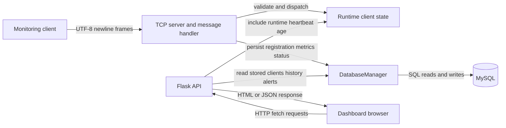

# Data Flow

This document follows the implemented monitoring path through the client,
TCP server, MySQL, Flask API, and browser dashboard. Process-list and
controlled-command requests are also described where they use the same path.

## 1. Complete Data Flow

The client sends monitoring data over TCP. The server processes and persists
it in MySQL. The browser then reads persisted values from Flask routes; Flask
and the TCP listener run in the same server process.

<!-- mermaid-checked: no \n, no em-dash/en-dash, no {} in labels, subgraphs are id["label"], arrows are -->|"label"|, all subgraphs closed by end, ids unique -->


Runtime state in the diagram is not a database substitute. It holds live
heartbeat timestamps, capabilities, disconnected markers, and pending
requests. Durable client, history, and alert records are stored in MySQL.

## 2. Client Registration Flow

1. `client/monitoring_client.py` starts through `main()`. The GUI calls
   `NetworkMonitoringClient.register()` when monitoring is started; the CLI
   calls it before entering its monitoring loop.
2. `NetworkMonitoringClient.register()` calls `TCPClient.register()`.
   `TCPClient.send()` opens an outgoing socket with
   `socket.create_connection((host, port), timeout=5)`.
3. The current TCP client sends a newline-terminated UTF-8 frame in this
   format:

   ```text
   REGISTER|<client_name>|<server_host>|<tcp_port>|PROCESS_LIST_V1|CONTROLLED_COMMANDS_V1
   ```

   The capability fields are appended by `TCPClient._build_message()` and
   are optional to the server, so older registration frames can omit them.
4. `server/server.py` accepts the connection in `tcp_server()` and starts a
   daemon `tcp_client_session()` handler thread. The handler splits complete
   lines and calls `handle_message()`. For `REGISTER`, the server checks that
   a name is present. It derives the stored IP address from the accepted
   socket's peer address; the supplied host/port fields are not used as the
   stored peer IP.
5. `handle_message()` calls `register_client()`. This first calls
   `DatabaseManager.register_client()`, which inserts into `clients` or
   updates the existing row with the same lowercase `client_key`. After the
   database write succeeds, `register_client()` updates the in-process
   `clients` map and capability flags.
6. The server sends `OK|REGISTERED\n` via `sendall()`.
7. `TCPClient` reads a line, interprets an `OK` response as success, and
   `NetworkMonitoringClient.register()` returns that result to the GUI/CLI.
   The server considers the client registered only after successful MySQL
   persistence.

If MySQL registration fails, the server returns `ERROR|DATABASE_UNAVAILABLE`
and does not mark registration successful in runtime state.

## 3. Monitoring Data Flow

The GUI worker loop and `run_cli()` both use
`NetworkMonitoringClient.collect_system_metrics()`. It calls `psutil` for:

- CPU utilization with `psutil.cpu_percent(interval=0.1)`.
- RAM utilization with `psutil.virtual_memory().percent`.
- Disk utilization for the system root path with `psutil.disk_usage(...)`.
- Network byte and packet counters with `psutil.net_io_counters()`.

The first network sample initializes the counter baseline. Later samples
calculate upload/download bytes per second from counter deltas and elapsed
monotonic time. Counter resets or unavailable counters are handled by the
collector; rates may be zero or `null` depending on the failure path. The
legacy `NETWORK` field is still sent as a normalized percentage for
compatibility; actual upload and download rates are separate fields.

The data then travels as follows:

1. GUI/CLI calls `NetworkMonitoringClient.send_metrics(**metrics)`.
2. `TCPClient.send_metrics()` builds a `SYSTEM` message. Fields include
   `CPU`, `RAM`, `DISK`, `NETWORK`, and optional `UPLOAD_BPS`,
   `DOWNLOAD_BPS`, `PACKETS_SENT`, and `PACKETS_RECV`.
3. `TCPClient.send()` opens a TCP connection, sends the newline-terminated
   UTF-8 frame, reads the server response, and closes the socket.
4. `tcp_client_session()` in `server/server.py` reads and frames the message,
   then calls `handle_message()`.
5. `handle_message()` parses percentage fields with `parse_metric()`, rates
   with `parse_network_rate()`, and packet counts with
   `parse_packet_counter()`. It calls `update_system()`, which rejects a
   client absent from runtime state or marked disconnected.
6. `update_system()` calls `DatabaseManager.update_metrics()`. That operation
   updates the latest fields in `clients` and inserts a sample in `history`
   in the same MySQL transaction. The server then adds separate alert records
   for CPU above 80%, RAM above 80%, or disk above 90%. On successful
   persistence, runtime status and heartbeat time are refreshed.
7. Later, Flask `api_clients()` and `api_alerts()` read MySQL data and return
   JSON. Dashboard JavaScript renders those responses in the browser.

The normal acknowledgement is `OK|SYSTEM`. If the client has not registered,
the server responds with an error rather than writing a new metrics row.

## 4. Heartbeat Flow

The GUI and CLI send a heartbeat after sending each monitoring sample. The
wire format is:

```text
HEARTBEAT|<client_name>
```

`handle_message()` calls `touch_client()`. If the client is registered and
not marked disconnected, `touch_client()` calls
`DatabaseManager.update_heartbeat()`, which updates `clients.status` to
`ONLINE` and writes `clients.last_seen`. After the database update succeeds,
the server refreshes the runtime `last_seen_epoch` and status. Without a
queued command/request, the response is `OK|HEARTBEAT`.

The dashboard's `/api/clients` endpoint gets the persisted `last_seen` from
MySQL. It also calculates `seconds_since_heartbeat` from the runtime
timestamp when present. Thus the heartbeat updates both the persisted
timestamp and the runtime value used for heartbeat age.

## 5. Multi-client Flow

When clients A, B, and C connect around the same time:

1. The listening socket's `accept()` returns a socket for each accepted
   connection.
2. `tcp_server()` starts one daemon `tcp_client_session()` thread per
   accepted socket. Each thread receives and handles its own frames.
3. The server identifies each client using its registered name, normalized
   to lowercase as the logical key. MySQL uses this value in the unique
   `clients.client_key`; the runtime dictionaries use the same normalized
   key.
4. Each valid client has its own `clients` row, `history` rows, and, when
   thresholds are crossed, `alerts` rows.
5. `state_lock` protects shared runtime maps. `DatabaseManager` has a
   separate lock and serializes operations on its MySQL connection.

The built-in agent normally opens short-lived TCP sockets per request;
registration, metrics, and heartbeat do not share one permanent connection.
Clients should use distinct names: names differing only by case normalize to
the same key and refer to the same logical database/runtime record.

## 6. Dashboard Data Flow

1. A browser loads `/` from the Flask application. `dashboard()` renders the
   HTML/CSS/JavaScript template embedded in `server/server.py`.
2. The JavaScript `refresh()` function fetches `/api/clients` and
   `/api/alerts` concurrently.
3. `api_clients()` calls `DatabaseManager.get_clients()`. It combines those
   stored rows with runtime heartbeat age via `client_snapshot()`.
   `api_alerts()` calls `DatabaseManager.get_alerts()`.
4. Flask returns JSON. The JavaScript updates client rows, online totals,
   traffic rates, last-seen values, and alerts.
5. The dashboard calls `refresh()` immediately and then every 2,500 ms.
   When a client is selected it separately fetches
   `/api/clients/<name>/history` for chart samples.

The browser receives monitoring metrics and alerts from MySQL-backed API
responses. The server adds runtime-derived heartbeat age to the clients
response; it does not query the TCP socket directly for dashboard rendering.

## 7. Database Persistence Flow

`DatabaseManager` in `common/database.py` owns the MySQL connection and uses
parameterized values in SQL statements.

| Event | SQL operation | Table(s) |
|---|---|---|
| Client registers | `INSERT ... ON DUPLICATE KEY UPDATE` | `clients` |
| Client sends metrics | `UPDATE` current metrics/status/last-seen, then `INSERT` metric sample | `clients`, `history` |
| Threshold exceeded | `INSERT` alert record | `alerts` |
| Heartbeat arrives | `UPDATE` online status and last-seen | `clients` |
| Client sends logout | `UPDATE` status to offline | `clients` |
| Server heartbeat checker marks offline | `UPDATE` status to offline | `clients` |
| Server starts | `UPDATE` any non-offline clients to offline | `clients` |
| Dashboard clients request | `SELECT` client rows | `clients` |
| Dashboard history request | `SELECT` bounded, ordered samples | `history` |
| Dashboard alerts request | `SELECT` latest bounded alert rows | `alerts` |

The metrics current-row update and history insert are committed together.
Alert insertion follows as a separate operation/commit. Runtime heartbeat
timestamps, capabilities, disconnect markers, and pending command state are
held in memory and are not durable database records.

## 8. Disconnect Flow

### Normal logout

When the user stops the GUI client or presses Ctrl+C in CLI mode, the client
calls `NetworkMonitoringClient.disconnect()` and sends
`LOGOUT|<client_name>`. The server updates the `clients` row to `OFFLINE`,
updates the runtime status, and responds `OK|LOGOUT`. The CLI attempts this
logout during its `KeyboardInterrupt` handling.

`LOGOUT` does not add the client to the server's forced-disconnect set. If the
same client continues sending valid heartbeats, the registered runtime entry
can be marked online again.

### TCP socket closes unexpectedly

Each normal request socket is closed after its reply; this is part of the
client's short-lived connection pattern, not by itself a client logout. If a
socket closes while a handler is waiting, `recv()` returning empty bytes
ends that handler; reset and other socket errors are logged and the handler
closes its socket. Such socket cleanup does not itself mark the registered
client offline in MySQL. If the agent has stopped sending messages, the
heartbeat timeout performs that status change later.

### Heartbeat timeout

The background `mark_offline_clients()` task checks runtime timestamps every
two seconds. If no client message refreshes a client's timestamp for more
than 15 seconds, it marks that client `OFFLINE` in runtime state and attempts
to update the MySQL status. A failed database status write is logged.

An administrator can also mark a client offline through the
token-protected `POST /api/clients/<name>/disconnect` route. This is a
server-side forced offline operation; it does not close a persistent client
socket because the normal agent transport does not keep one open.

## 9. Error Flow

| Failure | Implemented behavior |
|---|---|
| MySQL unavailable during startup | `start_services()` logs the failure and exits without starting the monitoring services. There is no RAM persistence fallback. |
| MySQL write/read failure after startup | Database operations attempt recovery/rollback as applicable. Message handling returns `ERROR|DATABASE_UNAVAILABLE` for failed message writes; affected API reads return an error JSON response with HTTP 503. |
| TCP connect/send/receive failure on client | `TCPClient.send()` logs the operation failure and returns an error result. GUI/CLI display the failure; they do not make the monitoring write durable elsewhere. |
| Client socket closes or resets | The server handler exits its receive/send loop, logs unexpected socket errors as appropriate, and closes the socket. Offline status is determined by logout or heartbeat timeout, not merely by handler cleanup. |
| Malformed TCP frame/message | The handler enforces a maximum frame size. `handle_message()` validates metrics and message structure and returns an `ERROR|...` response for malformed/unsupported input. |
| HTTP transport/API failure in dashboard | Dashboard JavaScript catches polling failures and displays an API-disconnected state; history fetch failures produce an empty chart sample list. |
| HTTP request through `HTTPClient` fails | `client/http_client.py` converts `HTTPError`/`URLError` into a result with `status: error`. |
| Invalid admin token | Protected API routes return HTTP 401; if no admin token is configured they return HTTP 503. The token value is not included in the server log message. |

## 10. End-to-End Example

Suppose client `PC01` measures CPU at `45%`:

1. `NetworkMonitoringClient.collect_system_metrics()` in
   `client/monitoring_client.py` calls `psutil.cpu_percent()` and returns
   `cpu: 45.0` along with RAM, disk, and network measurements.
2. The GUI monitoring worker or CLI loop passes that result to
   `NetworkMonitoringClient.send_metrics()`.
3. `TCPClient.send_metrics()` in `client/tcp_client.py` builds a frame such
   as:

   ```text
   SYSTEM|PC01|CPU=45.0|RAM=...|DISK=...|NETWORK=...|UPLOAD_BPS=...|DOWNLOAD_BPS=...|PACKETS_SENT=...|PACKETS_RECV=...
   ```

   It adds `\n`, encodes the frame as UTF-8, and sends it over a TCP socket.
4. In `server/server.py`, `tcp_server()` accepted the socket and started
   `tcp_client_session()`. The handler frames the line and calls
   `handle_message()`.
5. `handle_message()` validates the CPU value with `parse_metric()` and
   forwards all parsed metrics to `update_system()`.
6. `update_system()` calls `DatabaseManager.update_metrics()` in
   `common/database.py`. MySQL updates the current `clients` row for `pc01`
   and inserts the same sample into `history`. Since 45 is below the CPU
   alert threshold of 80, this sample does not generate a CPU alert.
7. The TCP handler returns `OK|SYSTEM`. On the next dashboard poll,
   `api_clients()` reads current metrics from MySQL and returns them as JSON;
   the dashboard JavaScript renders the CPU value in the browser.

This data path assumes `PC01` has already registered and MySQL persistence
succeeded.
