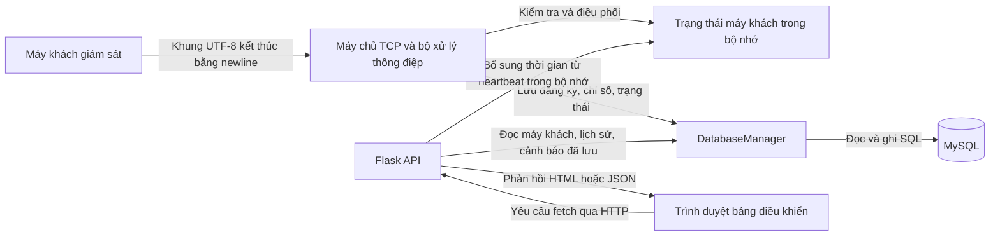

# Luồng dữ liệu

Tài liệu này mô tả luồng giám sát được triển khai từ máy khách, qua máy chủ
TCP, MySQL, API Flask đến bảng điều khiển trên trình duyệt. Các yêu cầu lấy
danh sách tiến trình và lệnh điều khiển cũng được mô tả khi chúng dùng cùng
luồng xử lý.

## 1. Luồng dữ liệu tổng thể

Máy khách gửi dữ liệu giám sát qua TCP. Máy chủ xử lý và lưu dữ liệu trong
MySQL. Sau đó, trình duyệt đọc các giá trị đã lưu thông qua các route Flask;
Flask và bộ lắng nghe TCP chạy trong cùng một tiến trình máy chủ.

<!-- mermaid-checked: no \n, no em-dash/en-dash, no {} in labels, subgraphs are id["label"], arrows are -->|"label"|, all subgraphs closed by end, ids unique -->


Trạng thái thời gian chạy trong sơ đồ không thay thế cơ sở dữ liệu. Nó lưu
thời điểm heartbeat trực tiếp, các khả năng, dấu đánh dấu máy khách đã ngắt
kết nối và những yêu cầu đang chờ. Các bản ghi máy khách, lịch sử và cảnh báo
bền vững được lưu trong MySQL.

## 2. Luồng đăng ký máy khách

1. `client/monitoring_client.py` khởi chạy thông qua `main()`. GUI gọi
   `NetworkMonitoringClient.register()` khi bắt đầu giám sát; CLI gọi hàm này
   trước khi vào vòng lặp giám sát.
2. `NetworkMonitoringClient.register()` gọi `TCPClient.register()`.
   `TCPClient.send()` mở một socket đi ra bằng
   `socket.create_connection((host, port), timeout=5)`.
3. Máy khách TCP hiện tại gửi khung UTF-8 kết thúc bằng newline theo định dạng:

   ```text
   REGISTER|<client_name>|<server_host>|<tcp_port>|PROCESS_LIST_V1|CONTROLLED_COMMANDS_V1|PROCESS_MANAGEMENT_V1
   ```

   Các trường khả năng được `TCPClient._build_message()` thêm vào và không
   bắt buộc đối với máy chủ, vì vậy các khung đăng ký từ phiên bản máy khách
   cũ có thể không chứa chúng.
4. `server/server.py` nhận kết nối trong `tcp_server()` và khởi chạy một luồng
   xử lý daemon `tcp_client_session()`. Bộ xử lý tách các dòng hoàn chỉnh rồi
   gọi `handle_message()`. Với `REGISTER`, máy chủ kiểm tra tên máy khách.
   Địa chỉ IP được lưu lấy từ địa chỉ peer của socket đã chấp nhận; các trường
   host/port do máy khách gửi không được dùng làm IP peer đã lưu.
5. `handle_message()` gọi `register_client()`. Trước tiên hàm này gọi
   `DatabaseManager.register_client()`, thao tác chèn vào `clients` hoặc cập
   nhật hàng hiện có có cùng `client_key` viết thường. Sau khi ghi cơ sở dữ
   liệu thành công, `register_client()` cập nhật map `clients` trong bộ nhớ
   và các cờ khả năng.
6. Máy chủ gửi `OK|REGISTERED\n` bằng `sendall()`.
7. `TCPClient` đọc một dòng, hiểu phản hồi `OK` là thành công và trả kết quả
   đó cho GUI/CLI qua `NetworkMonitoringClient.register()`. Máy chủ chỉ xem
   máy khách là đã đăng ký sau khi dữ liệu được lưu thành công trong MySQL.

Nếu thao tác đăng ký vào MySQL thất bại, máy chủ trả về
`ERROR|DATABASE_UNAVAILABLE` và không đánh dấu đăng ký thành công trong trạng
thái thời gian chạy.

## 3. Luồng dữ liệu giám sát

Vòng lặp worker của GUI và `run_cli()` đều dùng
`NetworkMonitoringClient.collect_system_metrics()`. Hàm này gọi `psutil` để
lấy:

- Mức sử dụng CPU bằng `psutil.cpu_percent(interval=0.1)`.
- Mức sử dụng RAM bằng `psutil.virtual_memory().percent`.
- Mức sử dụng ổ đĩa của đường dẫn gốc hệ thống bằng `psutil.disk_usage(...)`.
- Bộ đếm byte và gói tin mạng bằng `psutil.net_io_counters()`.

Mẫu mạng đầu tiên khởi tạo mốc bộ đếm. Các mẫu tiếp theo tính byte tải
lên/tải xuống mỗi giây từ độ chênh bộ đếm và thời gian đơn điệu đã trôi qua.
Trường hợp bộ đếm bị đặt lại hoặc không khả dụng được bộ thu thập xử lý; tốc
độ có thể là 0 hoặc `null` tùy trường hợp lỗi. Trường `NETWORK` cũ vẫn được
gửi dưới dạng phần trăm đã chuẩn hóa để duy trì khả năng tương thích; tốc độ
tải lên và tải xuống được gửi trong các trường riêng.

Dữ liệu đi qua các bước sau:

1. GUI/CLI gọi `NetworkMonitoringClient.send_metrics(**metrics)`.
2. `TCPClient.send_metrics()` tạo thông điệp `SYSTEM`. Các trường gồm `CPU`,
   `RAM`, `DISK`, `NETWORK` và các trường tùy chọn `UPLOAD_BPS`,
   `DOWNLOAD_BPS`, `PACKETS_SENT`, `PACKETS_RECV`.
3. `TCPClient.send()` mở kết nối TCP, gửi khung UTF-8 kết thúc bằng newline,
   đọc phản hồi máy chủ rồi đóng socket.
4. `tcp_client_session()` trong `server/server.py` đọc và đóng khung thông
   điệp, sau đó gọi `handle_message()`.
5. `handle_message()` phân tích các trường phần trăm bằng `parse_metric()`,
   tốc độ bằng `parse_network_rate()` và số gói bằng
   `parse_packet_counter()`. Hàm gọi `update_system()`, hàm này từ chối máy
   khách không có trong trạng thái thời gian chạy hoặc đã được đánh dấu ngắt
   kết nối.
6. `update_system()` gọi `DatabaseManager.update_metrics()`. Thao tác này cập
   nhật các trường mới nhất trong `clients` và chèn một mẫu vào `history`
   trong cùng giao dịch MySQL. Sau đó máy chủ thêm các bản ghi cảnh báo riêng
   cho CPU trên 80%, RAM trên 80% hoặc ổ đĩa trên 90%. Khi lưu thành công,
   trạng thái thời gian chạy và thời điểm heartbeat được làm mới.
7. Sau đó, Flask `api_clients()` và `api_alerts()` đọc dữ liệu MySQL rồi trả
   về JSON. JavaScript của bảng điều khiển hiển thị các phản hồi đó trên trình
   duyệt.

Phản hồi xác nhận thông thường là `OK|SYSTEM`. Nếu máy khách chưa đăng ký,
máy chủ trả lỗi thay vì ghi một hàng chỉ số mới.

## 4. Luồng heartbeat

GUI và CLI gửi heartbeat sau mỗi mẫu giám sát. Định dạng trên đường truyền là:

```text
HEARTBEAT|<client_name>
```

`handle_message()` gọi `touch_client()`. Nếu máy khách đã đăng ký và chưa bị
đánh dấu ngắt kết nối, `touch_client()` gọi
`DatabaseManager.update_heartbeat()`, hàm này cập nhật `clients.status` thành
`ONLINE` và ghi `clients.last_seen`. Sau khi cập nhật cơ sở dữ liệu thành
công, máy chủ làm mới `last_seen_epoch` và trạng thái trong thời gian chạy.
Nếu không có lệnh/yêu cầu nào đang chờ, phản hồi là `OK|HEARTBEAT`.

Điểm cuối `/api/clients` của bảng điều khiển lấy `last_seen` đã lưu từ
MySQL. Điểm cuối này cũng tính `seconds_since_heartbeat` từ dấu thời gian
trong thời gian chạy nếu có. Do đó, heartbeat cập nhật cả dấu thời gian đã
lưu lẫn giá trị thời gian chạy dùng để tính tuổi của heartbeat.

## 5. Luồng nhiều máy khách

Khi các máy khách A, B và C kết nối gần như cùng lúc:

1. `accept()` của socket đang lắng nghe trả về một socket cho mỗi kết nối
   được chấp nhận.
2. `tcp_server()` khởi chạy một luồng `tcp_client_session()` daemon cho mỗi
   socket đã chấp nhận. Mỗi luồng nhận và xử lý các khung riêng.
3. Máy chủ nhận diện từng máy khách theo tên đã đăng ký, chuẩn hóa thành chữ
   thường làm khóa logic. MySQL dùng giá trị này trong `clients.client_key`
   duy nhất; các từ điển thời gian chạy cũng dùng cùng khóa đã chuẩn hóa.
4. Mỗi máy khách hợp lệ có hàng riêng trong `clients`, các hàng riêng trong
   `history` và, nếu vượt ngưỡng, các hàng riêng trong `alerts`.
5. `state_lock` bảo vệ các map thời gian chạy dùng chung. `DatabaseManager`
   có một khóa riêng và tuần tự hóa các thao tác trên kết nối MySQL.

Tác nhân tích hợp sẵn thường mở socket TCP tồn tại ngắn cho từng yêu cầu;
đăng ký, chỉ số và heartbeat không dùng chung một kết nối duy trì lâu dài.
Máy khách nên dùng tên riêng biệt: tên chỉ khác nhau về chữ hoa/chữ thường sẽ
được chuẩn hóa thành cùng một khóa và trỏ đến cùng một bản ghi logic trong cơ
sở dữ liệu/trạng thái thời gian chạy.

## 6. Luồng dữ liệu bảng điều khiển

1. Trình duyệt tải `/` từ ứng dụng Flask. `dashboard()` kết xuất mẫu
   HTML/CSS/JavaScript được nhúng trong `server/server.py`.
2. Hàm JavaScript `refresh()` đồng thời tải `/api/clients` và `/api/alerts`.
3. `api_clients()` gọi `DatabaseManager.get_clients()`. Hàm kết hợp các hàng
   đã lưu với tuổi heartbeat trong thời gian chạy thông qua
   `client_snapshot()`. `api_alerts()` gọi `DatabaseManager.get_alerts()`.
4. Flask trả về JSON. JavaScript cập nhật các hàng máy khách, tổng số máy
   đang trực tuyến, tốc độ mạng, giá trị lần hoạt động gần nhất và cảnh báo.
5. Bảng điều khiển gọi `refresh()` ngay lập tức rồi lặp lại sau mỗi 2.500 ms.
   Khi chọn một máy khách, bảng điều khiển tải riêng
   `/api/clients/<name>/history` để lấy các mẫu vẽ biểu đồ.

Trình duyệt nhận chỉ số giám sát và cảnh báo qua phản hồi API dựa trên MySQL.
Máy chủ bổ sung tuổi heartbeat tính từ trạng thái thời gian chạy vào phản hồi
máy khách; nó không truy vấn trực tiếp socket TCP để hiển thị bảng điều khiển.

## 7. Luồng lưu trữ cơ sở dữ liệu

`DatabaseManager` trong `common/database.py` quản lý kết nối MySQL và dùng
tham số cho các giá trị trong câu lệnh SQL.

| Sự kiện | Thao tác SQL | (Các) bảng |
|---|---|---|
| Máy khách đăng ký | `INSERT ... ON DUPLICATE KEY UPDATE` | `clients` |
| Máy khách gửi chỉ số | `UPDATE` chỉ số/trạng thái/lần hoạt động gần nhất, sau đó `INSERT` mẫu chỉ số | `clients`, `history` |
| Vượt ngưỡng | `INSERT` bản ghi cảnh báo | `alerts` |
| Nhận heartbeat | `UPDATE` trạng thái trực tuyến và lần hoạt động gần nhất | `clients` |
| Máy khách đăng xuất | `UPDATE` trạng thái thành ngoại tuyến | `clients` |
| Bộ kiểm tra heartbeat của máy chủ đánh dấu ngoại tuyến | `UPDATE` trạng thái thành ngoại tuyến | `clients` |
| Máy chủ khởi động | `UPDATE` mọi máy khách chưa ngoại tuyến thành ngoại tuyến | `clients` |
| Yêu cầu danh sách máy khách từ bảng điều khiển | `SELECT` các hàng máy khách | `clients` |
| Yêu cầu lịch sử từ bảng điều khiển | `SELECT` các mẫu có giới hạn, sắp xếp theo thứ tự | `history` |
| Yêu cầu cảnh báo từ bảng điều khiển | `SELECT` các hàng cảnh báo gần nhất trong giới hạn | `alerts` |
| Snapshot tiến trình hợp lệ | So sánh snapshot trước/sau theo PID trong phạm vi client; chèn STARTED/STOPPED và xóa sự kiện cũ vượt quá 500 hàng/client | `process_activity` |
| Yêu cầu hoạt động tiến trình từ bảng điều khiển | `SELECT` các sự kiện mới nhất trong giới hạn | `process_activity` |
| Yêu cầu kết thúc tiến trình | Chèn yêu cầu audit rồi cập nhật kết quả/timeout | `process_termination_audit` |

Việc cập nhật hàng hiện tại của chỉ số và chèn lịch sử được commit cùng nhau.
Việc chèn cảnh báo diễn ra sau đó như một thao tác/commit riêng. Dấu thời gian
heartbeat trong thời gian chạy, khả năng, dấu ngắt kết nối và trạng thái lệnh
đang chờ và snapshot tiến trình mới nhất được lưu trong bộ nhớ, không phải bản
ghi bền vững trong cơ sở dữ liệu. Một collection thất bại chỉ đổi trạng thái
monitoring thành UNAVAILABLE; nó không làm mất snapshot gần nhất hoặc tạo sự
kiện STOPPED. Snapshot hợp lệ đầu tiên chỉ thiết lập baseline.

## 8. Luồng ngắt kết nối

### Đăng xuất bình thường

Khi người dùng dừng máy khách GUI hoặc nhấn Ctrl+C ở chế độ CLI, máy khách gọi
`NetworkMonitoringClient.disconnect()` và gửi `LOGOUT|<client_name>`. Máy chủ
cập nhật hàng `clients` thành `OFFLINE`, cập nhật trạng thái thời gian chạy
rồi trả về `OK|LOGOUT`. CLI cố gắng đăng xuất trong quá trình xử lý
`KeyboardInterrupt`.

`LOGOUT` không thêm máy khách vào tập ngắt kết nối cưỡng bức của máy chủ. Nếu
cùng máy khách tiếp tục gửi heartbeat hợp lệ, mục thời gian chạy đã đăng ký
có thể được đánh dấu trực tuyến trở lại.

### Socket TCP đóng bất ngờ

Mỗi socket yêu cầu thông thường được đóng sau khi nhận phản hồi; đây là một
phần của cách kết nối tồn tại ngắn của máy khách, tự nó không có nghĩa máy
khách đã đăng xuất. Nếu socket đóng khi bộ xử lý đang chờ, `recv()` trả về
byte rỗng và kết thúc bộ xử lý đó; lỗi reset và các lỗi socket khác được ghi
nhật ký, sau đó bộ xử lý đóng socket. Việc dọn dẹp socket không tự đánh dấu
máy khách đã đăng ký thành ngoại tuyến trong MySQL. Nếu tác nhân ngừng gửi
thông điệp, timeout heartbeat sẽ cập nhật trạng thái sau đó.

### Timeout heartbeat

Tác vụ nền `mark_offline_clients()` kiểm tra dấu thời gian trong thời gian
chạy mỗi hai giây. Nếu không có thông điệp nào làm mới dấu thời gian máy
khách trong hơn 15 giây, tác vụ đánh dấu máy khách đó là `OFFLINE` trong
trạng thái thời gian chạy và cố gắng cập nhật trạng thái MySQL. Lỗi khi ghi
trạng thái cơ sở dữ liệu sẽ được ghi nhật ký.

Quản trị viên cũng có thể đánh dấu máy khách ngoại tuyến qua route được bảo
vệ bằng token `POST /api/clients/<name>/disconnect`. Đây là thao tác ngoại
tuyến cưỡng bức phía máy chủ; nó không đóng một socket máy khách duy trì lâu
dài vì phương thức truyền tải thông thường của tác nhân không giữ kết nối mở.

## 9. Luồng xử lý lỗi

| Lỗi | Hành vi được triển khai |
|---|---|
| MySQL không khả dụng khi khởi động | `start_services()` ghi nhật ký lỗi và thoát mà không khởi chạy các dịch vụ giám sát. Không có phương án dự phòng lưu trữ trong RAM. |
| Lỗi đọc/ghi MySQL sau khi khởi động | Các thao tác cơ sở dữ liệu cố gắng khôi phục/rollback khi thích hợp. Bộ xử lý thông điệp trả `ERROR|DATABASE_UNAVAILABLE` nếu ghi thông điệp thất bại; các API đọc bị ảnh hưởng trả JSON lỗi với HTTP 503. |
| Máy khách gặp lỗi kết nối/gửi/nhận TCP | `TCPClient.send()` ghi nhật ký lỗi thao tác và trả về kết quả lỗi. GUI/CLI hiển thị lỗi; dữ liệu giám sát không được lưu bền vững ở nơi khác. |
| Socket máy khách đóng hoặc bị reset | Bộ xử lý máy chủ thoát vòng lặp nhận/gửi, ghi nhật ký lỗi socket bất thường khi phù hợp rồi đóng socket. Trạng thái ngoại tuyến được quyết định bởi đăng xuất hoặc timeout heartbeat, không chỉ do dọn dẹp bộ xử lý. |
| Khung/thông điệp TCP sai định dạng | Bộ xử lý áp dụng kích thước khung tối đa. `handle_message()` kiểm tra chỉ số và cấu trúc thông điệp, đồng thời trả phản hồi `ERROR|...` cho dữ liệu sai định dạng/không được hỗ trợ. |
| Lỗi truyền tải/API HTTP trên bảng điều khiển | JavaScript của bảng điều khiển bắt lỗi polling và hiển thị trạng thái API bị ngắt kết nối; lỗi tải lịch sử tạo danh sách mẫu biểu đồ rỗng. |
| Yêu cầu HTTP qua `HTTPClient` thất bại | `client/http_client.py` chuyển `HTTPError`/`URLError` thành kết quả có `status: error`. |
| Token quản trị không hợp lệ | Các route được bảo vệ trả HTTP 401; nếu chưa cấu hình token quản trị, chúng trả HTTP 503. Giá trị token không được đưa vào thông điệp nhật ký máy chủ. |

## 10. Ví dụ từ đầu đến cuối

Giả sử máy khách `PC01` đo được CPU ở mức `45%`:

1. `NetworkMonitoringClient.collect_system_metrics()` trong
   `client/monitoring_client.py` gọi `psutil.cpu_percent()` và trả về
   `cpu: 45.0` cùng các chỉ số RAM, ổ đĩa và mạng.
2. Worker giám sát GUI hoặc vòng lặp CLI chuyển kết quả đó cho
   `NetworkMonitoringClient.send_metrics()`.
3. `TCPClient.send_metrics()` trong `client/tcp_client.py` tạo một khung như:

   ```text
   SYSTEM|PC01|CPU=45.0|RAM=...|DISK=...|NETWORK=...|UPLOAD_BPS=...|DOWNLOAD_BPS=...|PACKETS_SENT=...|PACKETS_RECV=...
   ```

   Hàm thêm `\n`, mã hóa khung thành UTF-8 và gửi qua socket TCP.
4. Trong `server/server.py`, `tcp_server()` chấp nhận socket và khởi chạy
   `tcp_client_session()`. Bộ xử lý tạo khung dòng rồi gọi `handle_message()`.
5. `handle_message()` kiểm tra giá trị CPU bằng `parse_metric()` và chuyển
   tất cả chỉ số đã phân tích cho `update_system()`.
6. `update_system()` gọi `DatabaseManager.update_metrics()` trong
   `common/database.py`. MySQL cập nhật hàng `clients` hiện tại của `pc01`
   và chèn cùng mẫu đó vào `history`. Vì 45 thấp hơn ngưỡng cảnh báo CPU là
   80, mẫu này không tạo cảnh báo CPU.
7. Bộ xử lý TCP trả về `OK|SYSTEM`. Ở lần polling tiếp theo của bảng điều
   khiển, `api_clients()` đọc chỉ số hiện tại từ MySQL và trả về dưới dạng
   JSON; JavaScript của bảng điều khiển hiển thị giá trị CPU trên trình duyệt.

Luồng dữ liệu này giả định `PC01` đã đăng ký và dữ liệu đã được lưu thành
công vào MySQL.

## 11. Luồng quản lý tiến trình từ xa

1. Người quản trị chọn máy khách đang trực tuyến trong GUI Tkinter hoặc bảng
   điều khiển web, tải danh sách tiến trình rồi có thể tìm theo tên, lọc
   trạng thái, sắp xếp theo PID/CPU/RAM và chọn PID cần kết thúc.
2. GUI yêu cầu token quản trị cho từng thao tác; dashboard hỏi một lần và chỉ
   giữ token trong bộ nhớ trang. Cả hai gửi `X-Admin-Token` tới
   `/api/clients/<name>/commands`. Máy chủ kiểm tra token, allowlist lệnh,
   khả năng và trạng thái máy khách, cũng như PID. Lệnh kết thúc được ghi vào
   `process_termination_audit` trước khi xếp hàng.
3. Yêu cầu được gửi ở heartbeat kế tiếp theo định dạng khung TCP hiện có.
   Lệnh quản lý tiến trình mang request ID và chữ ký HMAC-SHA256 ràng buộc
   với request ID, tên máy khách, lệnh và PID (nếu có); token không được gửi
   trong khung TCP.
4. `client/tcp_client.py` xác minh chữ ký bằng biến môi trường
   `MONITOR_ADMIN_TOKEN`, từ chối chữ ký không hợp lệ hoặc request ID đã xử lý,
   rồi gọi `collect_process_list()` cho danh sách GUI giới hạn 50 tiến trình,
   `collect_process_snapshot()` cho snapshot dashboard giới hạn 1.000 tiến
   trình hoặc `terminate_process()`. Snapshot dashboard vượt giới hạn, quá
   lớn hoặc không đầy đủ được báo là không khả dụng. Helper kết thúc từ chối
   PID không hợp lệ, tiến trình hệ thống/agent được bảo vệ, tiến trình đã dừng
   hoặc thao tác bị hệ điều hành từ chối.
5. Máy khách trả kết quả qua TCP. Máy chủ kiểm tra peer, request ID và schema
   trước khi hoàn tất yêu cầu; kết quả hoặc timeout cập nhật bản ghi audit.
   Giao diện hiển thị lỗi và tải lại danh sách sau khi kết thúc thành công để
   xác minh PID đã biến mất.

Dashboard yêu cầu snapshot theo chu kỳ 10 giây, so sánh snapshot thành công
gần nhất của đúng máy khách theo PID và tên tiến trình, rồi hiển thị danh sách
hiện tại cùng sự kiện STARTED/STOPPED mới nhất. Snapshot thành công đầu tiên
chỉ tạo baseline; snapshot không đầy đủ hoặc không khả dụng giữ nguyên danh
sách gần nhất và không được diễn giải thành việc mọi tiến trình đã dừng.

HMAC xác thực và bảo vệ tính toàn vẹn lệnh nhưng không mã hóa TCP, cũng không
xác thực kết nối máy khách thông thường. Cần cấu hình cùng một khóa ngẫu
nhiên dài trên máy chủ và trong môi trường tiến trình của từng máy khách;
không đưa khóa thật vào `.env.example` hoặc nhật ký.
