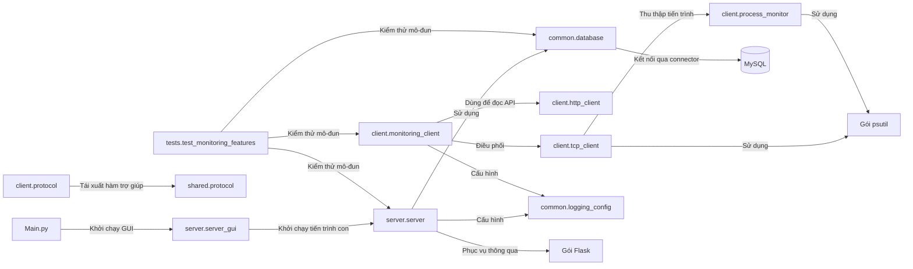

# Cấu trúc dự án

Danh mục này bao gồm mã nguồn ứng dụng, các bài kiểm thử và tài liệu có trong
kho lưu trữ. Danh mục không bao gồm tệp được tạo tự động, môi trường ảo, nhật
ký và cấu hình bí mật cục bộ.

## 1. Cây thư mục

```text
P2Pminiproject/
├── Main.py
├── client/
│   ├── __init__.py
│   ├── http_client.py
│   ├── monitoring_client.py
│   ├── process_monitor.py
│   ├── protocol.py
│   └── tcp_client.py
├── common/
│   ├── __init__.py
│   ├── command_auth.py
│   ├── database.py
│   ├── logging_config.py
│   └── message_protocol.py
├── docs/
│   ├── ARCHITECTURE.md
│   ├── DATA_FLOW.md
│   └── PROJECT_STRUCTURE.md
├── server/
│   ├── __init__.py
│   ├── server.py
│   └── server_gui.py
├── shared/
│   ├── __init__.py
│   └── protocol.py
├── tests/
│   ├── test_monitoring_features.py
│   └── test_process_management.py
├── .env.example
├── .gitignore
├── README.md
└── requirements.txt
```

Tệp `.env` cũng tồn tại dưới dạng cấu hình cục bộ trong workspace đã kiểm
tra, nhưng bị `.gitignore` loại trừ và nội dung không được liệt kê ở đây.

## 2. Trách nhiệm của các tệp

| Tệp | Mục đích | Lớp/Hàm quan trọng | Phụ thuộc vào |
|---|---|---|---|
| `Main.py` | Mở cửa sổ trình quản lý máy chủ trên máy tính để bàn. **Loại:** điểm vào GUI. | `main()` | `tkinter`, `server.server_gui.ServerManagerGUI` |
| `client/__init__.py` | Cung cấp các lớp máy khách và trình chạy CLI từ gói. **Loại:** giao diện gói. | `NetworkMonitoringClient`, `MonitoringClient`, `P2PClient`, `ClientGUI`, `run_cli` | `client.monitoring_client` |
| `client/monitoring_client.py` | Triển khai điều phối giám sát, lấy mẫu chỉ số, GUI, CLI và phản hồi cho người dùng máy khách. **Loại:** máy khách / GUI. | `NetworkMonitoringClient`, `ClientGUI`, `collect_system_metrics()`, `run_cli()`, `main()` | `psutil`, `TCPClient`, `HTTPClient`, Tkinter, `threading`, `common.logging_config` |
| `client/tcp_client.py` | Mở kết nối TCP, tạo/phân tích khung giám sát, xác minh HMAC và phản hồi các yêu cầu nằm trong danh sách cho phép. **Loại:** máy khách / giao thức. | `TCPClient`, `_build_message()`, `send()`, `_answer_server_command()` | `socket`, `json`, `psutil`, `client.process_monitor`, `common.command_auth` |
| `client/http_client.py` | Gửi yêu cầu HTTP GET/POST đến API trạng thái và danh sách máy khách, đồng thời chuẩn hóa lỗi URL. **Loại:** máy khách / API. | `HTTPClient`, `get()`, `post()`, `health()`, `list_clients()` | `urllib` thư viện chuẩn, `json` |
| `client/process_monitor.py` | Thu thập/giới hạn thông tin tiến trình và kết thúc PID hợp lệ, từ chối tiến trình được bảo vệ. **Loại:** máy khách / tiện ích. | `collect_process_list()`, `terminate_process()`, `_bounded_percentage()` | `psutil`, `os`, `platform` |
| `client/protocol.py` | Tái xuất các hàm trợ giúp giao thức JSON dùng chung trong gói máy khách. **Loại:** bộ chuyển đổi giao thức. | `encode_message`, `decode_message` | `shared.protocol` |
| `server/__init__.py` | Đánh dấu `server` là gói Python. **Loại:** gói. | Không có | Không có |
| `server/server.py` | Chạy bộ lắng nghe/bộ xử lý TCP, xử lý thông điệp và trạng thái thời gian chạy, khởi chạy Flask, cung cấp API/bảng điều khiển và quản lý heartbeat/chuyển trạng thái ngoại tuyến. **Loại:** máy chủ / API / bảng điều khiển. | `tcp_server()`, `tcp_client_session()`, `handle_message()`, `register_client()`, `update_system()`, `touch_client()`, API tiến trình/lệnh, `start_services()` | Flask, sockets, threads, `DatabaseManager`, `common.command_auth`, cấu hình ghi nhật ký dùng chung |
| `server/server_gui.py` | Khởi động/dừng tiến trình con của máy chủ, thu thập đầu ra, hiển thị danh sách máy khách, mở bảng điều khiển web và cửa sổ quản lý tiến trình. **Loại:** GUI máy chủ. | `ServerManagerGUI`, `ClientProcessWindow`, `start_server()`, `stop_server()`, `open_client_processes()` | Tkinter, `subprocess`, `threading`, `urllib`, `webbrowser` |
| `common/__init__.py` | Đánh dấu `common` là gói Python. **Loại:** gói. | Không có | Không có |
| `common/database.py` | Nạp thiết lập môi trường dự án, quản lý kết nối/khôi phục MySQL, tạo bảng và đọc/ghi bản ghi giám sát/audit. **Loại:** cơ sở dữ liệu / lưu trữ. | `DatabaseManager`, `connect()`, `register_client()`, `update_metrics()`, `add_process_termination_audit()`, `complete_process_termination_audit()` | `mysql.connector`, `python-dotenv`, `logging`/`threading`/`time` của thư viện chuẩn |
| `common/command_auth.py` | Tạo và xác minh chữ ký HMAC-SHA256 gắn với request ID, máy khách, lệnh và đối số. **Loại:** xác thực lệnh dùng chung. | `sign_process_command()`, `verify_process_command()` | `hashlib`, `hmac`, `json` |
| `common/logging_config.py` | Cấu hình ghi nhật ký ra console và tệp luân phiên, đồng thời che các mẫu bí mật thường gặp. **Loại:** tiện ích / ghi nhật ký. | `SecretRedactionFilter`, `configure_logging()` | `logging`, `logging.handlers`, `pathlib`, `re` |
| `common/message_protocol.py` | Định nghĩa các hằng chuỗi cho hành động và phản hồi; luồng TCP giám sát không import mô-đun này. **Loại:** hằng giao thức. | Các hằng như `CMD_REGISTER`, `RES_OK` | Không có |
| `shared/__init__.py` | Đánh dấu `shared` là gói Python. **Loại:** gói. | Không có | Không có |
| `shared/protocol.py` | Mã hóa/giải mã đối tượng JSON gồm `action` và `payload`. **Loại:** tiện ích giao thức. | `ProtocolError`, `encode_message()`, `decode_message()`, `parse_response()` | `json`, `typing` của thư viện chuẩn |
| `tests/test_monitoring_features.py` | Chứa các bài kiểm thử dạng unit dùng mock và kiểm thử TCP loopback, cùng một bài kiểm thử tích hợp MySQL bật tùy chọn. **Loại:** kiểm thử. | Các lớp kiểm thử hiện có | `unittest`, sockets, mocks, các mô-đun ứng dụng |
| `tests/test_process_management.py` | Kiểm thử chính sách PID, HMAC, lệnh TCP/API, audit và cách ly yêu cầu giữa các máy khách. **Loại:** kiểm thử. | Các lớp kiểm thử quản lý tiến trình | `unittest`, mocks, các mô-đun máy khách/máy chủ |

## 3. Các lớp quan trọng

| Lớp | Tệp | Trách nhiệm |
|---|---|---|
| `NetworkMonitoringClient` | `client/monitoring_client.py` | Điều phối việc thu thập chỉ số và các thao tác TCP/HTTP của máy khách. |
| `ClientGUI` | `client/monitoring_client.py` | Hiển thị trạng thái/chỉ số máy khách và chạy worker giám sát. |
| `TCPClient` | `client/tcp_client.py` | Triển khai truyền tải TCP, đóng khung thông điệp và phản hồi các lệnh được hỗ trợ. |
| `HTTPClient` | `client/http_client.py` | Gửi yêu cầu HTTP đến các điểm cuối trạng thái và danh sách máy khách. |
| `ServerManagerGUI` | `server/server_gui.py` | Quản lý tiến trình con của máy chủ và các điều khiển máy chủ trên máy tính để bàn. |
| `DatabaseManager` | `common/database.py` | Đóng gói vòng đời kết nối MySQL và các thao tác lưu trữ. |
| `SecretRedactionFilter` | `common/logging_config.py` | Che các mẫu mật khẩu/token được nhận diện khỏi bản ghi nhật ký. |
| `ProtocolError` | `shared/protocol.py` | Biểu thị dữ liệu đầu vào giao thức JSON không hợp lệ. |

## 4. Các hàm quan trọng

| Hàm | Tệp | Trách nhiệm |
|---|---|---|
| `main()` | `Main.py` | Mở GUI quản lý máy chủ. |
| `main()` | `client/monitoring_client.py` | Phân tích đối số máy khách và chọn chế độ GUI hoặc CLI. |
| `run_cli()` | `client/monitoring_client.py` | Đăng ký, giám sát, in chỉ số CLI và thử đăng xuất an toàn. |
| `collect_system_metrics()` | `client/monitoring_client.py` | Lấy mẫu CPU, RAM, ổ đĩa và bộ đếm mạng bằng `psutil`. |
| `collect_process_list()` | `client/process_monitor.py` | Tạo danh sách tiến trình có giới hạn. |
| `tcp_server()` | `server/server.py` | Gắn địa chỉ/lắng nghe/chấp nhận máy khách TCP và khởi tạo các luồng xử lý. |
| `tcp_client_session()` | `server/server.py` | Đọc thông điệp TCP đã đóng khung, gửi phản hồi và đóng socket được chấp nhận. |
| `handle_message()` | `server/server.py` | Kiểm tra và điều phối thông điệp giám sát, heartbeat, đăng xuất và phản hồi. |
| `register_client()` | `server/server.py` | Lưu đăng ký rồi ghi trạng thái máy khách trong thời gian chạy. |
| `update_system()` | `server/server.py` | Lưu chỉ số và cảnh báo ngưỡng tương ứng, sau đó cập nhật trạng thái thời gian chạy. |
| `touch_client()` | `server/server.py` | Lưu dấu thời gian/trạng thái heartbeat và cập nhật trạng thái heartbeat trong bộ nhớ. |
| `mark_offline_clients()` | `server/server.py` | Định kỳ đánh dấu máy khách ngoại tuyến khi heartbeat hết hạn. |
| `api_clients()` / `api_alerts()` | `server/server.py` | Trả dữ liệu máy khách và cảnh báo dựa trên MySQL cho các bên gọi HTTP. |
| `start_services()` | `server/server.py` | Cấu hình ghi nhật ký, kiểm tra cổng/MySQL và khởi chạy dịch vụ máy chủ. |
| `load_project_environment()` | `common/database.py` | Chỉ nạp giá trị `.env` khi biến môi trường tương ứng chưa được đặt. |
| `configure_logging()` | `common/logging_config.py` | Thêm các handler console và tệp luân phiên bằng thiết lập môi trường. |
| `encode_message()` / `decode_message()` | `shared/protocol.py` | Tuần tự hóa hoặc phân tích thông điệp JSON gồm action/payload. |

## 5. Thư viện

### Thư viện bên thứ ba

Đây là các phụ thuộc được khai báo trong `requirements.txt`; các import đã
được kiểm tra trong mã nguồn ứng dụng.

| Thư viện | Nơi sử dụng | Mục đích |
|---|---|---|
| Flask | `server/server.py` | Route, phản hồi JSON, kết xuất mẫu bảng điều khiển và máy chủ HTTP. |
| mysql-connector-python (`mysql.connector`) | `common/database.py` | Kết nối MySQL và thực thi truy vấn lưu trữ. |
| psutil | `client/monitoring_client.py`, `client/process_monitor.py`, `client/tcp_client.py` | Lấy mẫu chỉ số hệ thống/mạng và thông tin tiến trình. Mã nguồn import tùy chọn; khi thiếu thư viện, chức năng bị giới hạn hoặc báo không khả dụng. |
| python-dotenv (`dotenv`) | `common/database.py` | Đọc cấu hình khóa/giá trị từ tệp `.env` của dự án. |

`requests` không có trong `requirements.txt` và không được ứng dụng đã kiểm
tra sử dụng. Các yêu cầu HTTP dùng `urllib` thuộc thư viện chuẩn Python.

### Thư viện chuẩn

| Mô-đun | Nơi sử dụng | Mục đích |
|---|---|---|
| `socket` | Máy khách, máy chủ và trình quản lý máy chủ | Tạo kết nối TCP đi ra, lắng nghe/chấp nhận phiên máy chủ và kiểm tra cổng. |
| `threading` | Máy khách, máy chủ, cơ sở dữ liệu và GUI máy chủ | Chạy vòng lặp worker máy khách, bộ xử lý từng kết nối, tác vụ nền và đọc nhật ký GUI. |
| `tkinter` | `Main.py`, GUI máy khách, trình quản lý máy chủ | Cung cấp các giao diện máy tính để bàn. |
| `urllib` | `client/http_client.py`, `server/server_gui.py` | Gửi yêu cầu HTTP mà không cần gói HTTP bổ sung. |
| `subprocess` | `server/server_gui.py` | Khởi chạy `python -m server.server` và thu thập đầu ra. |
| `json` | Máy khách, máy chủ, giao thức dùng chung, GUI máy chủ | Mã hóa/giải mã dữ liệu API và lệnh điều khiển. |
| `logging` | Máy khách, máy chủ, cơ sở dữ liệu, tiện ích ghi nhật ký | Ghi các sự kiện chẩn đoán vận hành. |
| `argparse` | `client/monitoring_client.py` | Phân tích chế độ GUI/CLI và thiết lập kết nối máy khách. |
| `hmac` | `server/server.py` | So sánh token quản trị bằng `compare_digest`. |
| `unittest` và `unittest.mock` | `tests/test_monitoring_features.py` | Định nghĩa kiểm thử và thay thế dịch vụ/trạng thái bên ngoài trong các kiểm thử dạng unit. |

## 6. Quan hệ phụ thuộc

Các đường nối liền bên dưới biểu thị import/lời gọi đã được xác minh trong mã
nguồn. Gói trợ giúp JSON dùng chung có tồn tại, nhưng luồng TCP giám sát đang
hoạt động không gọi gói này.

<!-- mermaid-checked: no \n, no em-dash/en-dash, no {} in labels, subgraphs are id["label"], arrows are -->|"label"|, all subgraphs closed by end, ids unique -->


`server.server` chứa bộ lắng nghe TCP, các route Flask và mẫu bảng điều khiển.
`client.monitoring_client` điều phối cả `TCPClient` lẫn `HTTPClient`. Máy chủ
không import các hàm trợ giúp `shared.protocol` cho giao thức pipe theo dòng.

## 7. Tệp cấu hình

| Tệp | Mục đích |
|---|---|
| `.env` | Thiết lập cục bộ được `common/database.py` đọc; có trong máy cục bộ nhưng bị Git bỏ qua. Giá trị được cố ý không sao chép vào đây. Giá trị biến môi trường tiến trình không rỗng được ưu tiên hơn giá trị trong tệp. |
| `.env.example` | Mẫu an toàn cho cấu hình MySQL và `MONITOR_ADMIN_TOKEN` để quản lý tiến trình; token mẫu để trống, không chứa bí mật thật. |
| `requirements.txt` | Phiên bản tối thiểu của Flask, psutil, MySQL Connector/Python và python-dotenv. |
| `.gitignore` | Loại trừ `.env`, môi trường ảo, bytecode được tạo, tệp cơ sở dữ liệu và nhật ký. |
| `README.md` | Tổng quan dự án, lệnh khởi chạy và tóm tắt cấu hình. |

Các nhóm cấu hình:

- **TCP:** `MONITOR_TCP_PORT` đặt cổng máy chủ (mặc định `8888`). Máy khách
  cũng nhận `--host` và `--port`; giá trị mặc định là localhost và cổng 8888.
- **HTTP:** `MONITOR_HTTP_PORT` đặt cổng Flask (mặc định `8081`). Máy khách
  nhận `--http-port`.
- **MySQL:** `MYSQL_HOST`, `MYSQL_PORT`, `MYSQL_USER`, `MYSQL_PASSWORD`,
  `MYSQL_DB` và `MYSQL_CREATE_DATABASE`.
- **Admin API và lệnh TCP:** `MONITOR_ADMIN_TOKEN` bảo vệ thao tác danh sách
  tiến trình, lệnh điều khiển và ngắt kết nối phía máy chủ; cùng khóa phải
  được đặt trong môi trường tiến trình máy khách để xác minh HMAC. Token
  không bắt buộc đối với các route chỉ đọc của bảng điều khiển.
- **Ghi nhật ký:** `LOG_LEVEL` điều khiển mức ghi nhật ký dùng chung; nhật ký
  máy chủ dùng `LOG_FILE` (mặc định `logs/server.log`), nhật ký máy khách
  dùng `CLIENT_LOG_FILE` (mặc định `logs/client.log`).
- **Chu kỳ lấy mẫu máy khách:** `--interval` điều khiển chu kỳ chỉ số CLI/GUI
  (mặc định 3 giây).

## 8. Kiểm thử

Kho lưu trữ có các mô-đun kiểm thử `tests/test_monitoring_features.py` và
`tests/test_process_management.py`. Chúng sử dụng Python `unittest` và
`unittest.mock`.

- **Kiểm thử dạng unit:** bao phủ phân tích/trạng thái máy chủ, hành vi máy
  khách, thu thập và kết thúc tiến trình, chữ ký HMAC/chống phát lại, audit,
  lỗi/kết nối lại cơ sở dữ liệu, ghi nhật ký và phản hồi API. Các lời gọi cơ
  sở dữ liệu thường được giả lập.
- **Kiểm thử tích hợp loopback:** tạo socket TCP cục bộ và gọi các handler
  `tcp_client_session()` thực tế để xác minh đầy đủ hành vi yêu cầu/phản hồi
  và ngắt kết nối mà không cần máy chủ bên ngoài.
- **Kiểm thử tích hợp MySQL bật tùy chọn:** `MySQLMultiClientIntegrationTests`
  kiểm thử máy khách đồng thời với cơ sở dữ liệu MySQL kiểm thử đã cấu hình.
  Kiểm thử bị bỏ qua trừ khi đặt `MYSQL_INTEGRATION_TEST=1` và
  `MYSQL_INTEGRATION_TEST_DB`; cơ sở dữ liệu phải có thể truy cập và được dùng
  để lưu bản ghi kiểm thử.
- **Kiểm thử thủ công:** không tìm thấy tập lệnh hoặc thư mục kiểm thử thủ
  công riêng trong cây dự án đã kiểm tra. Có thể thao tác thủ công với GUI
  tương tác của máy khách và máy chủ, nhưng đây không phải bộ kiểm thử tự động.

## 9. Ghi chú quan trọng

- `shared/protocol.py` tuần tự hóa đối tượng JSON chứa `action` và `payload`.
  `client/protocol.py` chỉ tái xuất các hàm đó. Máy khách TCP giám sát đang
  hoạt động tạo khung phân tách bằng dấu pipe và kết thúc bằng newline trong
  `client/tcp_client.py`; không mô tả trợ giúp JSON là định dạng dùng cho lưu
  lượng giám sát.
- `common/message_protocol.py` định nghĩa các hằng action/result nhưng không
  được luồng TCP giám sát đang hoạt động import trong mã nguồn đã kiểm tra.
- `client/http_client.py` dùng `urllib` của thư viện chuẩn; không có phụ thuộc
  `requests`.
- HTML của bảng điều khiển được nhúng trong `server/server.py`; không có thư
  mục frontend riêng hoặc tệp HTML bảng điều khiển độc lập trong cây nguồn đã
  kiểm tra.
- Trạng thái thời gian chạy và yêu cầu đang chờ nằm trong bộ nhớ tiến trình
  máy chủ; bản ghi máy khách, chỉ số/lịch sử và cảnh báo được lưu trong MySQL.
- Kho lưu trữ có `docs/ARCHITECTURE.md`, `docs/DATA_FLOW.md` và
  `docs/PROJECT_STRUCTURE.md`; không tìm thấy tài liệu kỹ thuật nào khác
  trong `docs/`.
