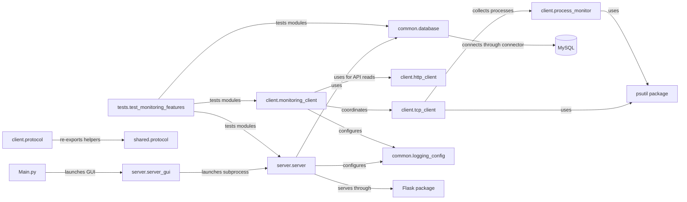

# Project Structure

This inventory covers the application source, its tests, and documentation
present in the repository. It excludes generated files, virtual environments,
logs, and local secret configuration.

## 1. Directory Tree

```text
P2Pminiproject/
├── Main.py
├── client/
│   ├── __init__.py
│   ├── http_client.py
│   ├── monitoring_client.py
│   ├── process_monitor.py
│   ├── protocol.py
│   └── tcp_client.py
├── common/
│   ├── __init__.py
│   ├── database.py
│   ├── logging_config.py
│   └── message_protocol.py
├── docs/
│   ├── ARCHITECTURE.md
│   ├── DATA_FLOW.md
│   └── PROJECT_STRUCTURE.md
├── server/
│   ├── __init__.py
│   ├── server.py
│   └── server_gui.py
├── shared/
│   ├── __init__.py
│   └── protocol.py
├── tests/
│   └── test_monitoring_features.py
├── .env.example
├── .gitignore
├── README.md
└── requirements.txt
```

`.env` also exists as a local configuration file in the inspected workspace,
but it is excluded by `.gitignore` and is not listed with its contents here.

## 2. File Responsibilities

| File | Purpose | Important Classes/Functions | Depends On |
|---|---|---|---|
| `Main.py` | Starts the server-manager desktop window. **Type:** GUI entry point. | `main()` | `tkinter`, `server.server_gui.ServerManagerGUI` |
| `client/__init__.py` | Exposes client classes and CLI runner from the package. **Type:** package interface. | `NetworkMonitoringClient`, `MonitoringClient`, `P2PClient`, `ClientGUI`, `run_cli` | `client.monitoring_client` |
| `client/monitoring_client.py` | Implements monitoring coordination, metrics sampling, GUI, CLI, and user-facing client feedback. **Type:** Client / GUI. | `NetworkMonitoringClient`, `ClientGUI`, `collect_system_metrics()`, `run_cli()`, `main()` | `psutil`, `TCPClient`, `HTTPClient`, Tkinter, `threading`, `common.logging_config` |
| `client/tcp_client.py` | Opens TCP connections, builds/parses monitoring frames, and responds to allowlisted requests. **Type:** Client / Protocol. | `TCPClient`, `_build_message()`, `send()`, `_answer_server_command()` | `socket`, `json`, `psutil`, `client.process_monitor` |
| `client/http_client.py` | Makes HTTP GET/POST calls to health and client-list APIs and normalizes URL errors. **Type:** Client / API. | `HTTPClient`, `get()`, `post()`, `health()`, `list_clients()` | Standard-library `urllib`, `json` |
| `client/process_monitor.py` | Collects and bounds process information, skipping inaccessible or exited processes. **Type:** Client / Utility. | `collect_process_list()`, `_bounded_percentage()` | `psutil` |
| `client/protocol.py` | Re-exports shared JSON protocol helpers under the client package. **Type:** Protocol adapter. | `encode_message`, `decode_message` | `shared.protocol` |
| `server/__init__.py` | Marks `server` as a Python package. **Type:** Package. | None | None |
| `server/server.py` | Runs the TCP listener/handlers, processes messages and runtime state, starts Flask, serves API/dashboard, and manages heartbeat/offline transitions. **Type:** Server / API / Dashboard. | `tcp_server()`, `tcp_client_session()`, `handle_message()`, `register_client()`, `update_system()`, `touch_client()`, Flask routes, `start_services()` | Flask, sockets, threads, `DatabaseManager`, shared logging configuration |
| `server/server_gui.py` | Starts/stops the server subprocess, captures its output, displays client rows, and opens the web dashboard. **Type:** Server GUI. | `ServerManagerGUI`, `start_server()`, `stop_server()`, `open_dashboard()` | Tkinter, `subprocess`, `threading`, `urllib`, `webbrowser` |
| `common/__init__.py` | Marks `common` as a Python package. **Type:** Package. | None | None |
| `common/database.py` | Loads project environment settings, owns MySQL connection/recovery, creates tables, and reads/writes monitoring records. **Type:** Database / Persistence. | `DatabaseManager`, `connect()`, `register_client()`, `update_metrics()`, `get_clients()`, `get_history()`, `get_alerts()` | `mysql.connector`, `python-dotenv`, standard-library logging/threading/time |
| `common/logging_config.py` | Configures console and rotating-file logging and redacts common secret patterns. **Type:** Utility / Logging. | `SecretRedactionFilter`, `configure_logging()` | `logging`, `logging.handlers`, `pathlib`, `re` |
| `common/message_protocol.py` | Defines action and response string constants; the monitoring TCP path does not import this module. **Type:** Protocol constants. | Constants such as `CMD_REGISTER`, `RES_OK` | None |
| `shared/__init__.py` | Marks `shared` as a Python package. **Type:** Package. | None | None |
| `shared/protocol.py` | Encodes/decodes JSON objects with `action` and `payload`. **Type:** Protocol utility. | `ProtocolError`, `encode_message()`, `decode_message()`, `parse_response()` | Standard-library `json`, `typing` |
| `tests/test_monitoring_features.py` | Contains unit-style tests with mocks and loopback TCP tests, plus an opt-in MySQL integration test. **Type:** Test. | Test classes listed in [Tests](#8-tests) | `unittest`, sockets, mocks, application modules |

## 3. Important Classes

| Class | File | Responsibility |
|---|---|---|
| `NetworkMonitoringClient` | `client/monitoring_client.py` | Coordinates metric collection and the client's TCP/HTTP operations. |
| `ClientGUI` | `client/monitoring_client.py` | Displays client status/measurements and runs the monitoring worker. |
| `TCPClient` | `client/tcp_client.py` | Implements the client's TCP transport, framing, and supported command responses. |
| `HTTPClient` | `client/http_client.py` | Makes HTTP requests to health and client-list endpoints. |
| `ServerManagerGUI` | `server/server_gui.py` | Manages the server subprocess and desktop server controls. |
| `DatabaseManager` | `common/database.py` | Encapsulates MySQL connection lifecycle and persistence operations. |
| `SecretRedactionFilter` | `common/logging_config.py` | Redacts recognized password/token patterns from log records. |
| `ProtocolError` | `shared/protocol.py` | Represents invalid JSON protocol input. |

## 4. Important Functions

| Function | File | Responsibility |
|---|---|---|
| `main()` | `Main.py` | Opens the server-manager GUI. |
| `main()` | `client/monitoring_client.py` | Parses client arguments and selects GUI or CLI mode. |
| `run_cli()` | `client/monitoring_client.py` | Registers, monitors, prints CLI metrics, and attempts graceful logout. |
| `collect_system_metrics()` | `client/monitoring_client.py` | Samples CPU, RAM, disk, and network counters using `psutil`. |
| `collect_process_list()` | `client/process_monitor.py` | Produces a bounded process list. |
| `tcp_server()` | `server/server.py` | Binds/listens/accepts TCP clients and starts handler threads. |
| `tcp_client_session()` | `server/server.py` | Reads framed TCP messages, sends replies, and closes the accepted socket. |
| `handle_message()` | `server/server.py` | Validates and routes monitoring, heartbeat, logout, and response messages. |
| `register_client()` | `server/server.py` | Persists registration, then records runtime client state. |
| `update_system()` | `server/server.py` | Persists metric data and applicable threshold alerts, then updates runtime state. |
| `touch_client()` | `server/server.py` | Persists heartbeat timestamp/status and updates runtime heartbeat state. |
| `mark_offline_clients()` | `server/server.py` | Periodically marks clients offline after heartbeat expiry. |
| `api_clients()` / `api_alerts()` | `server/server.py` | Return MySQL-backed client and alert data to HTTP callers. |
| `start_services()` | `server/server.py` | Configures logging, checks ports/MySQL, and starts server services. |
| `load_project_environment()` | `common/database.py` | Loads `.env` values only where environment variables are not already set. |
| `configure_logging()` | `common/logging_config.py` | Adds console and rotating-file handlers using environment settings. |
| `encode_message()` / `decode_message()` | `shared/protocol.py` | Serialize or parse JSON action/payload messages. |

## 5. Libraries

### Third-party libraries

These are the declared dependencies in `requirements.txt`; imports were
checked in the application source.

| Library | Where Used | Purpose |
|---|---|---|
| Flask | `server/server.py` | Routes, JSON responses, rendering the dashboard template, and the HTTP server. |
| mysql-connector-python (`mysql.connector`) | `common/database.py` | Connects to MySQL and executes persistence queries. |
| psutil | `client/monitoring_client.py`, `client/process_monitor.py`, `client/tcp_client.py` | Samples system/network metrics and process information. Imports are optional in source; functionality degrades or reports unavailable when absent. |
| python-dotenv (`dotenv`) | `common/database.py` | Reads key/value configuration from the project `.env` file. |

`requests` is not in `requirements.txt` and is not used by the inspected
application. HTTP client calls use Python's standard-library `urllib`.

### Standard library

| Module | Where Used | Purpose |
|---|---|---|
| `socket` | Client, server, and server manager | Creates outgoing TCP connections, listens/accepts server sessions, and checks ports. |
| `threading` | Client, server, database, and server GUI | Runs client worker loops, per-connection handlers, background tasks, and GUI log reading. |
| `tkinter` | `Main.py`, client GUI, server manager | Provides desktop interfaces. |
| `urllib` | `client/http_client.py`, `server/server_gui.py` | Makes HTTP requests without an extra HTTP package. |
| `subprocess` | `server/server_gui.py` | Launches `python -m server.server` and captures its output. |
| `json` | Client, server, shared protocol, server GUI | Encodes/decodes API and controlled-command data. |
| `logging` | Client, server, database, logging utility | Writes operational diagnostic events. |
| `argparse` | `client/monitoring_client.py` | Parses GUI/CLI mode and client connection settings. |
| `hmac` | `server/server.py` | Compares admin tokens with `compare_digest`. |
| `unittest` and `unittest.mock` | `tests/test_monitoring_features.py` | Defines tests and replaces external services/state in unit-style tests. |

## 6. Dependency Relationships

Solid connections below represent imports/calls verified in source. The
shared JSON helper package exists, but the active TCP monitoring path does
not call it.

<!-- mermaid-checked: no \n, no em-dash/en-dash, no {} in labels, subgraphs are id["label"], arrows are -->|"label"|, all subgraphs closed by end, ids unique -->


`server.server` contains the TCP listener, Flask routes, and dashboard
template. `client.monitoring_client` coordinates both `TCPClient` and
`HTTPClient`. The server does not import the `shared.protocol` helpers for its
line-based pipe protocol.

## 7. Configuration Files

| File | Purpose |
|---|---|
| `.env` | Local settings read by `common/database.py`; present locally but ignored by Git. Values are intentionally not reproduced here. Non-empty process environment values take precedence over values in the file. |
| `.env.example` | Safe template for `MYSQL_HOST`, `MYSQL_PORT`, `MYSQL_USER`, `MYSQL_PASSWORD`, `MYSQL_DB`, and `MYSQL_CREATE_DATABASE`. Its example sets database creation to `false`. |
| `requirements.txt` | Lower bounds for Flask, psutil, MySQL Connector/Python, and python-dotenv. |
| `.gitignore` | Excludes `.env`, virtual environments, generated bytecode, database files, and logs. |
| `README.md` | Project overview, startup commands, and summarized configuration. |

Configuration groups:

- **TCP:** `MONITOR_TCP_PORT` sets the server port (default `8888`). The
  client also accepts `--host` and `--port`; its defaults are localhost and
  port 8888.
- **HTTP:** `MONITOR_HTTP_PORT` sets the Flask port (default `8081`). The
  client accepts `--http-port`.
- **MySQL:** `MYSQL_HOST`, `MYSQL_PORT`, `MYSQL_USER`, `MYSQL_PASSWORD`,
  `MYSQL_DB`, and `MYSQL_CREATE_DATABASE`.
- **Admin API:** `MONITOR_ADMIN_TOKEN` protects process-list, controlled
  command, and server-side client-disconnect operations. It is not required
  for the read-only dashboard routes.
- **Logging:** `LOG_LEVEL` controls the shared logging level; server logs use
  `LOG_FILE` (default `logs/server.log`) and client logs use
  `CLIENT_LOG_FILE` (default `logs/client.log`).
- **Client sampling:** `--interval` controls the CLI/GUI metric interval
  (default 3 seconds).

## 8. Tests

The repository has one test module: `tests/test_monitoring_features.py`.
It uses Python `unittest` and `unittest.mock`.

- **Unit-style tests:** cover server parsing/state, client behavior, process
  collection, database error/reconnect behavior, logging, and API responses.
  Database calls are generally mocked in these tests.
- **Loopback integration tests:** create local TCP sockets and invoke real
  `tcp_client_session()` handlers to verify complete request/reply and
  disconnect behavior without requiring an external server.
- **Opt-in MySQL integration test:** `MySQLMultiClientIntegrationTests`
  exercises concurrent clients against a configured MySQL test database. It
  is skipped unless `MYSQL_INTEGRATION_TEST=1` and
  `MYSQL_INTEGRATION_TEST_DB` are set; the database must be reachable and is
  used for test records.
- **Manual tests:** no separate manual-test script or manual test directory
  was found in the inspected project tree. The interactive client and server
  GUIs can be exercised manually, but that is not an automated test suite.

## 9. Important Notes

- `shared/protocol.py` serializes JSON objects containing `action` and
  `payload`. `client/protocol.py` only re-exports those functions. The active
  monitoring TCP client instead builds pipe-delimited, newline-terminated
  frames in `client/tcp_client.py`; do not describe the JSON helper as the
  format used by monitoring traffic.
- `common/message_protocol.py` defines action/result constants, but it is not
  imported by the active monitoring TCP path in the inspected source.
- `client/http_client.py` uses the standard library `urllib`; there is no
  `requests` dependency.
- The dashboard HTML is embedded in `server/server.py`; there is no separate
  frontend directory or standalone dashboard HTML file in the inspected
  source tree.
- Runtime state and queued requests are in server process memory, while
  client records, metrics/history, and alerts are persisted in MySQL.
- The repository includes `docs/ARCHITECTURE.md`, `docs/DATA_FLOW.md`, and
  `docs/PROJECT_STRUCTURE.md`; no separate `docs/` technical documents beyond
  these three were found.
